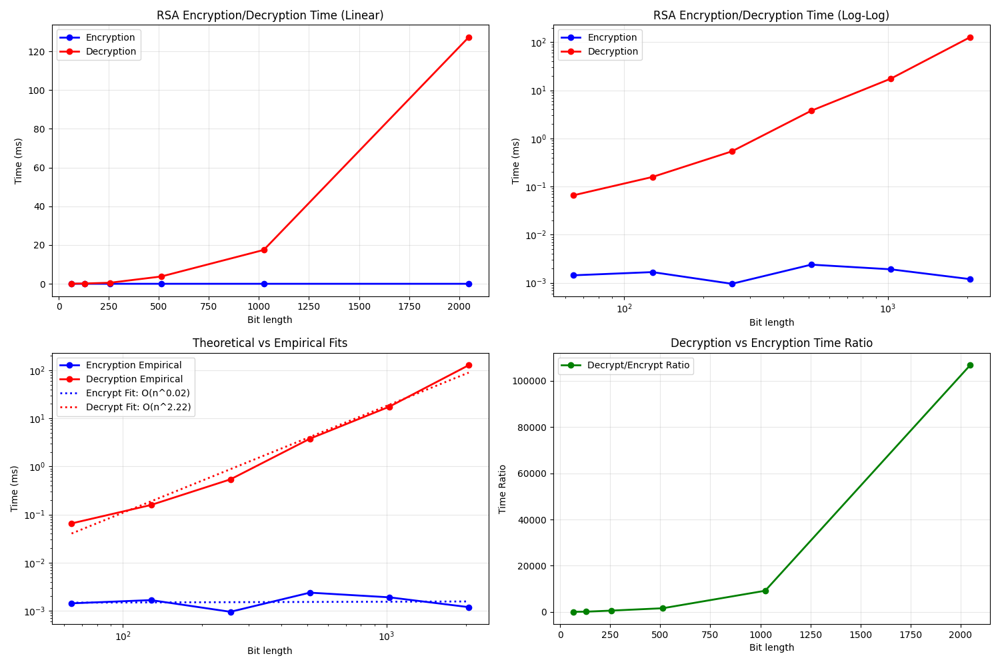

# Project Report - RSA and Primality Tests

## Baseline

### Design Experience

I worked on this project with my little brother Luke, who is also taking the class. For the Baseline, we decided that we would start the generate_large_primes() function 
by calling random.getrandbits() with however many bits were passed into the function. With this random number of bit length n, we would run fermat's algorithm on it with 
the k value given to us (20). If it fails Fermat's, then we generate another large prime and try again. We basically just keep generating random numbers until one passes 
Fermat's. Once it passes, we return that number.

For Fermat's algorithm, we pass in the random number generated earlier (N) and our k value (20). Then we iterate k times, each time creating a random number between 1 and N-1 (a).
On each iteration we then run modular exponentiation with a, the exponent (N-1) and the modulos (N). If the result of the modular exponentiation returns 1 for every single a,
then we return true, as the number is most likely prime.

For Modular exponentiation, we start by declaring our base case (if the exponent == 0 then return 1). Then we recursively call mod_exp setting, the value of each call to a 
variable (z), doing floor division on the exponent (y // 2) each call. As we recurse back up, we'll see if y is divisible by 2, if so we'll square z (the return from last call)
and then mod it by N. If y is not divisible by 2, we'll square z, multiply it by x, and then mod it by N. As recurse back up we'll be left with the modular representation of the
original number.

### Theoretical Analysis - Prime Number Generation

#### Time

```py
def generate_large_prime(n_bits: int) -> int:
    num = random.getrandbits(n_bits)
    if fermat(num, 20) == False:                               # Called O(n) times expected (prime density ~1/n)
        return generate_large_prime(n_bits)                    
    else: return num

def fermat(N: int, k: int) -> bool:
    if N == 2 or N == 3: return True
    if N <= 1 or N % 2 == 0 or N % 3 == 0: return False
    for j in range(1, k + 1):                                  # O(k) iterations
        a = random.randint(1, N - 1)
        if mod_exp(a, N - 1, N) != 1: return False             # Called k times per fermat test
    return True

def mod_exp(x: int, y: int, N: int) -> int:
    if y == 0: return 1
    z = mod_exp(x, y // 2, N)                                  # O(n) recursive calls (bit length)
    if y % 2 == 0: return (z ** 2) % N                         # O(n²) multiplication
    else: return (x * (z ** 2)) % N                            # O(n²) multiplication
```
The Time complexity of generate_large_prime is O(k * n^4). At the lowest level we call mod_Exp which runs in O(n^3 times) since it has O(n) recursive calls, and then O(n^2) multiplication per call. Then
fermat run just runs the mod_exp function k-times, so it is O(n^3 * k). We can expect generate large primes to take about n tries to actually generate a prime number of bit length n since prime density is 1/n (n bits).
This leaves us with a total time complexity of O(n^4 * k)

#### Space
```py
def generate_large_prime(n_bits: int) -> int:
    num = random.getrandbits(n_bits)
    if fermat(num, 20) == False:
        return generate_large_prime(n_bits)                    # O(n) recursion depth expected
    else: return num

def fermat(N: int, k: int) -> bool:
    if N == 2 or N == 3: return True
    if N <= 1 or N % 2 == 0 or N % 3 == 0: return False
    for j in range(1, k + 1):                                  # O(1) space for loop
        a = random.randint(1, N - 1)
        if mod_exp(a, N - 1, N) != 1: return False             # O(n) space from recursion
    return True

def mod_exp(x: int, y: int, N: int) -> int:
    if y == 0: return 1
    z = mod_exp(x, y // 2, N)                                  # O(n) recursion depth
    if y % 2 == 0: return (z ** 2) % N
    else: return (x * (z ** 2)) % N
```
The Space complexity of generate_large_prime is O(n^2). We can expect the recursion depth of generate_large_prime to be O(n) since it should take n number of tries to find a prime. We also expect the
mod_exp function to have recursion depth of O(n). Since these are nested, our overall space complexity should be O(n^2)


### Empirical Data

| N    | time (ms) |
|------|-----------|
| 64   | 0.6       |
| 128  | 2.3       |
| 256  | 50.3      |
| 512  | 142.7     |
| 1024 | 1980.6    |
| 2048 | 59343.7   |

### Comparison of Theoretical and Empirical Results

- Theoretical order of growth: O(k*n^4)
- Measured constant of proportionality for theoretical order: 3.37 * 10^(-12)
- Empirical order of growth (if different from theoretical): n^3.8 (very close, I would say this matches)
- Measured constant of proportionality for empirical order: 3.07 × 10^(-11)

Our theoretical was actually very close to our empirical. There isn't much to question.


## Core

### Design Experience

My brother Luke and I talked about how we would need to run generate_large_prime two times, accounting for the case in which they are equal to each other. Then, we would set them
equal to p and q, then we need to iterate through primes to find an e that is coprime with (p-1)*(q-1). Then we need to run extended euclid's with e and (p-1)*(q-1) to find our d 
value. Then we return N, the product of the original 2 primes, and our e and d values.

### Theoretical Analysis - Key Pair Generation

#### Time

```py
def generate_key_pairs(n_bits) -> tuple[int, int, int]:
    p = generate_large_prime(n_bits)                           # O(k·n⁴)
    q = generate_large_prime(n_bits)                           # O(k·n⁴)
    if p == q or p == None or q == None:
        return generate_key_pairs(n_bits)                      # Rare case, doesn't affect complexity

    N = p*q                                                    # O(n²) multiplication
    r = (p-1)*(q-1)                                            # O(n²) multiplication
    e = 1

    for prime in primes:                                       # O(1) fixed list iteration
        if gcd(prime, r) == 1:                                 # O(n) per gcd call
            e = prime
            break

    d, _, _ = extended_euclid(e, r)                            # O(n^3)
    d = d % r                                                

    return N, e, d

def gcd(a, b):
    if b == 0:
        return a
    return gcd(b, a % b)                                       # O(n) recursive calls

def extended_euclid(a, b):
    if b == 0:
        return 1, 0, a
    x, y, d = extended_euclid(b, a % b)                        # O(n) recursive calls
    return y, x - y * (a // b), d                              # O(n^2)  multiplication                 
```
The Time complexity is O(k*n^4) for generate_key_pairs. We run generate_large_prime twice, which is O(k*n^4). Then, we multiply p*q and (p-1)*(q-1) which is O(n^2), 
and we run euclid's, which is O(n), and extended euclid's, which is O(n^3). Really, nothing else can dominate the time complexity of random number generation, so O(k*n^4) dominates everything.

#### Space

```pycon
def generate_key_pairs(n_bits) -> tuple[int, int, int]:
    p = generate_large_prime(n_bits)                           # O(n^2) space
    q = generate_large_prime(n_bits)                           # O(n^2) space  
    if p == q or p == None or q == None:
        return generate_key_pairs(n_bits)                      # Additional O(n²) if recursive

    N = p*q                                                    # O(n) space
    r = (p-1)*(q-1)                                            # O(n) space
    e = 1

    for prime in primes:                                       # O(1) space
        if gcd(prime, r) == 1:                                 # O(n) space from recursion
            e = prime
            break

    d, _, _ = extended_euclid(e, r)                            # O(n) space from recursion
    d = d % r                                                  # O(n) space

    return N, e, d

def gcd(a, b):
    if b == 0:
        return a
    return gcd(b, a % b)                                       # O(n) recursion depth

def extended_euclid(a, b):                                     # O(n^2)
    if b == 0:
        return 1, 0, a
    x, y, d = extended_euclid(b, a % b)                        # O(n) recursion depth
    return y, x - y * (a // b), d                              # O(n) multiplication
```

The Space complexity is O(n^2) for generate_key_pairs. As established, generate_large_prime is O(n^2) complexity, and we call that twice in the very beginning. Multiplication takes O(n) space complexity.
Extended Euclid's also is O(n^2) since it has a recursion depth of n, and it performs multiplication on each layer of recursion. We are left with O(3*2^n) or O(2^n).


### Empirical Data

| N    | time (ms) |
|------|-----------|
| 64   | 4         |
| 128  | 17.10     |
| 256  | 20.6      |
| 512  | 502.4     |
| 1024 | 1012.7    |
| 2048 | 56433.4   |

### Comparison of Theoretical and Empirical Results

- Theoretical order of growth: again, O(k*n^4)
- Measured constant of proportionality for theoretical order: 3.21 × 10^(-9)
- Empirical order of growth (if different from theoretical): n^3.14
- Measured constant of proportionality for empirical order: 7.79 × 10^(-13)

Our empirical runtime was a bit faster than our theoretical runtime. I imagine it is just due to efficiencies in modern cpu caching and python interpreters.


## Stretch 1

### Design Experience

Luke and I sent eachother messages using eachother's public keys. I'm not sure what else to say here.

### Theoretical Analysis - Encrypt and Decrypt

#### Time

```pycon
def transform(
    data: bytes,
    N: int,
    exponent: int,
    in_chunk_bytes: int,
    out_chunk_bytes: int,
) -> bytes:
    out = []
    for block in chunks(data, in_chunk_bytes):                          # O(1)
        if len(block) != in_chunk_bytes:
            raise ValueError("Input not aligned to chunk size.")
        x = int.from_bytes(block, "big")
        y = mod_exp(x, exponent, N)                                     # O(n^3)
        out.append(y.to_bytes(out_chunk_bytes, "big"))
    return b"".join(out)

def main(key_file: Path, message_file: Path, output_file: Path):
    n_bytes, plain_bytes, N, exponent = read_key(key_file)              # O(1)
    input_bytes = message_file.read_bytes()                             # O(L)

    mode = decide_mode(len(input_bytes), n_bytes)
    start = time()
    if mode == "encrypt":
        prepared = add_len_header_and_pad(input_bytes, plain_bytes)
        # plaintext blocks -> ciphertext blocks
        result = transform(                                                                 # O(n^3) for encrypt
            prepared, N, exponent, in_chunk_bytes=plain_bytes, out_chunk_bytes=n_bytes
        )
    else:
        # ciphertext blocks -> plaintext blocks
        decrypted_blocks = transform(                                                       # O(n^3) for decrypt
            input_bytes, N, exponent, in_chunk_bytes=n_bytes, out_chunk_bytes=plain_bytes
        )
        result = strip_len_header_and_unpad(decrypted_blocks)
    print(f"{mode} in {time() - start:.6f} seconds")
    output_file.write_bytes(result)
```

The Time complexity of encrypt and decrypt are O(n^3). Transform iterates through the blocks of the input, running mod_exp on each block. We decided to treat the block iteration as a constant time operations since
we had no idea how to deal with that.

#### Space

```pycon
def transform(
    data: bytes,
    N: int,
    exponent: int,
    in_chunk_bytes: int,
    out_chunk_bytes: int,
) -> bytes:
    out = []
    for block in chunks(data, in_chunk_bytes):                      # O(1)
        if len(block) != in_chunk_bytes:
            raise ValueError("Input not aligned to chunk size.")
        x = int.from_bytes(block, "big")
        y = mod_exp(x, exponent, N)                                 # O(n) mod_exp is O(n) ^
        out.append(y.to_bytes(out_chunk_bytes, "big"))
    return b"".join(out)

def main(key_file: Path, message_file: Path, output_file: Path):
    n_bytes, plain_bytes, N, exponent = read_key(key_file)          # O(length)
    input_bytes = message_file.read_bytes()                         

    mode = decide_mode(len(input_bytes), n_bytes)
    start = time()
    if mode == "encrypt":
        prepared = add_len_header_and_pad(input_bytes, plain_bytes)     # O(n) stores bytes
        # plaintext blocks -> ciphertext blocks
        result = transform(                                             # O(n)
            prepared, N, exponent, in_chunk_bytes=plain_bytes, out_chunk_bytes=n_bytes
        )
    else:
        # ciphertext blocks -> plaintext blocks
        decrypted_blocks = transform(                                   # O(n)
            input_bytes, N, exponent, in_chunk_bytes=n_bytes, out_chunk_bytes=plain_bytes
        )
        result = strip_len_header_and_unpad(decrypted_blocks)
    print(f"{mode} in {time() - start:.6f} seconds")
    output_file.write_bytes(result)
```

The Space complexity of encrypt and decrypt are both O(length + n). The function has to store the message, and they key to encrypt and decrypt. We get O(length) while reading in the file, and O(n) while
running mod_exp.

### Empirical Data

#### Encryption

| N    | time (ms) |
|------|-----------|
| 64   | 0.001     |
| 128  | 0.001     |
| 256  | 0.001     |
| 512  | 0.002     |
| 1024 | 0.002     |
| 2048 | 0.001     |

#### Decryption

| N    | time (ms) |
|------|-----------|
| 64   | 0.066     |
| 128  | 0.158     |
| 256  | 0.5440    |
| 512  | 3.771     |
| 1024 | 17.476    |
| 2048 | 127.330   |

### Comparison of Theoretical and Empirical Results

#### Encryption

- Theoretical order of growth: O(n^3)
- Measured constant of proportionality for theoretical order: 0.00047 ms/bit
- Empirical order of growth (if different from theoretical): O(n^0.02)
- Measured constant of proportionality for empirical order: 0.10 ms

The empirical growth of my encryption was really small. It ran SO much faster than I expected. I'm really confused as to why. There must be lots of ways to make it more efficient.

#### Decryption

- Theoretical order of growth: O(n^3)
- Measured constant of proportionality for theoretical order: 0.00022 ms/bit^2
- Empirical order of growth (if different from theoretical): O(n^2.22)
- Measured constant of proportionality for empirical order: 0.0024ms/bit^2

The emprical order of growth for encryption was pretty close to my theoretical, though, a bit faster still. Again, I think it's just efficiencies in modern computers and cpu caching.



### Encrypting and Decrypting With A Classmate

My brother Luke and I sent eachother messages and eachother's public keys and decrypted them. It was fun.

Luke's encrypted message was:

��4�ה�̵(W�ьq�F��&��ҙK�~�+�k-�������8����3`8%#3�Yy`�� ��$PN����

I decrypted it with his secret key:

10768852168092548963283839052520081597
89

and ended up with:

"fourscore and seven years ago, jack moved into the colony"

## Stretch 2

### Design Experience

Miller Rabin is a lot like Fermat's, so Luke and I started there. However, instead of returning true when modexp returns 2
we then cut the exponent in half and run again and again. If we get something other than 1, then we return false, unless it
is a -1, then we return true.

### Discussion: Probabilistic Natures of Fermat and Miller Rabin 

Since Miller Rabin does multiple passes on each number, really scrutinizing each one, the chances of it missing primes goes down.
In fact, Miller Rabin is capable of catching carmichael numbers, which Fermat misses. While Fermat is slightly Faster, Miller Rabin
also doesn't need as many passes to reach the same probability as Fermat. It is just kind of better.

```py
def fermat(N: int, k: int) -> bool:
    if N == 2 or N == 3: return True
    if N <= 1 or N % 2 == 0 or N % 3 == 0: return False
    for j in range(1, k + 1):
        a = random.randint(1, N - 1)
        if mod_exp(a, N - 1, N) != 1: return False
    return True
```

```py
def miller_rabin(N: int, k: int) -> bool:
    if N == 2 or N == 3: return True
    if N <= 1 or N % 2 == 0 or N % 3 == 0: return False
    for i in range(k):
        exponent = N - 1
        a = random.randint(1, exponent)
        while exponent >= 1:
            result = mod_exp(a, exponent, N)
            if result != 1 and result != N-1 : return False
            if result == N-1: break
            if exponent % 2 == 1: break
            else: exponent = exponent // 2
    return True
```

## Project Review

I reviewed my project with my brother Luke. Luke wrote a lot of his code differently than I did. For our Generate Large
Primes function, I used recursion and he used a while loop. Our Fermat's functions were written very similarly, as well
as our mod_exp functions. We basically got those from the slides. For our generate key pairs, I again used recursion while
Luke used a while loop to generate our 2 primes. I also created another function gcd to find if e was coprime, where as
Luke implemented that into his extended euclid's. Our extended euclid's were once again very similar, as we both got
them from the slides. Our miller rabin functions were also pretty similar, but we had different orders of doing things.
Our runtimes were quote similar since we planned our methods together. I think my generate large primes data was kind 
of an outlier, because it literally took longer than my generate key pair function.