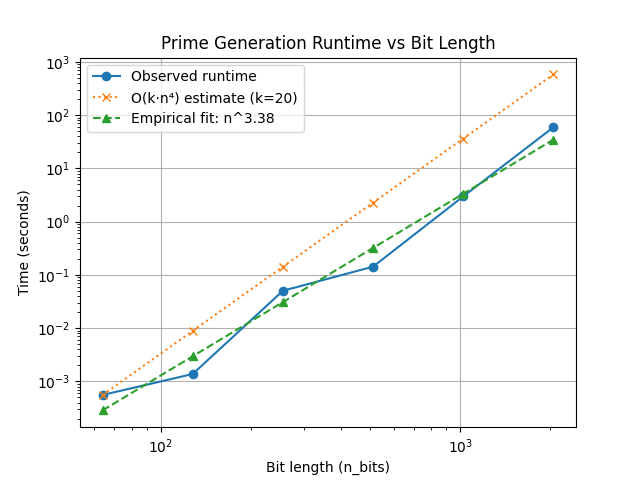
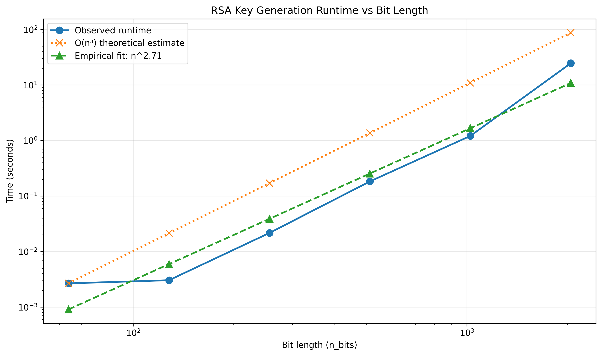

# Project Report - RSA and Primality Tests

## Baseline

### Design Experience

I worked on this project with my little brother Luke, who is also taking the class. For the Baseline, we decided that we would start the generate_large_primes() function 
by calling random.getrandbits() with however many bits were passed into the function. With this random number of bit length n, we would run fermat's algorithm on it with 
the k value given to us (20). If it fails Fermat's, then we generate another large prime and try again. We basically just keep generating random numbers until one passes 
Fermat's. Once it passes, we return that number.

For Fermat's algorithm, we pass in the random number generated earlier (N) and our k value (20). Then we iterate k times, each time creating a random number between 1 and N-1 (a).
On each iteration we then run modular exponentiation with a, the exponent (N-1) and the modulos (N). If the result of the modular exponentiation returns 1 for every single a,
then we return true, as the number is most likely prime.

For Modular exponentiation, we start by declaring our base case (if the exponent == 0 then return 1). Then we recursively call mod_exp setting, the value of each call to a 
variable (z), doing floor division on the exponent (y // 2) each call. As we recurse back up, we'll see if y is divisible by 2, if so we'll square z (the return from last call)
and then mod it by N. If y is not divisible by 2, we'll square z, multiply it by x, and then mod it by N. As recurse back up we'll be left with the modular representation of the
original number.

### Theoretical Analysis - Prime Number Generation

#### Time and Space

```py
def mod_exp(x: int, y: int, N: int) -> int:
    if y == 0: return 1
    z = mod_exp(x, y // 2, N)
    if y % 2 == 0: return (z ** 2) % N
    else: return (x * (z ** 2)) % N
```
The time complexity of mod_exp is O(n^3). The function is called recursively and splits the magnitude of the exponent in half each tine. This decrements the bit value by 1, so this 
runs at O(n). The multiplication we do on each return step is O(n^2), so we end up with O(n^3).

The Space complexity is O(n). Since the function cuts y in half each time, the bit size is decreased by one every recursive call. So the depth of the recursion is bound by the bit size n.

```py
def fermat(N: int, k: int) -> bool:
    if N == 2 or N == 3: return True
    if N <= 1 or N % 2 == 0 or N % 3 == 0: return False
    for j in range(1, k + 1):
        a = random.randint(1, N - 1)
        if mod_exp(a, N - 1, N) != 1: return False
    return True
```
The time complexity of Fermat's is O(k*n^3). We iterated k times, and run mod_exp which is O(n^3) on each iteration.

The Space complexity is O(n), because it iteratively calls mod_exp, which is O(n) space complexity.

```py
def generate_large_prime(n_bits: int) -> int:
    num = random.getrandbits(n_bits)
    if fermat(num, 20) == False:
        return generate_large_prime(n_bits)
    else: return num
```
The time complexity of this function (treating Fermat as a constant time operation) is O(k*n^4). This is because the function is dependent on how long it takes to find a prime number 
of bit size n. The chances of finding a prime number decreases at a rate of 1/n bits (the number of bits long the number can be). So, since the chance of finding a prime decreases
linearly as a function of the inverse of n, the time complexity actually finding a prime number is bounded by O(n). We run Fermat's each time we test a numbers primality, and since Fermat's
is O(k*N^3) our overall time complexity is O(k*n^4).

Space complexity is O(n) Although this function is recursive, it recurses linearly, and the number of times it will run is linear with n.

### Empirical Data

| N    | time (ms) |
|------|-----------|
| 64   | 0.6       |
| 128  | 2.3       |
| 256  | 50.3      |
| 512  | 142.7     |
| 1024 | 1980.6    |
| 2048 | 59343.7   |

### Comparison of Theoretical and Empirical Results

- Theoretical order of growth: O(k*n^4) ~ growth ratio of about 16 * k
- Measured constant of proportionality for theoretical order: 3.37 * 10^(-12)
- Empirical order of growth (if different from theoretical): The growth ratio is closer to 20 near the end. This is pretty close to our 16 considering we also multiply by k
- Measured constant of proportionality for empirical order: 3.07 × 10^(-11)



## Core

### Design Experience

My brother Luke and I talked about how we would need to run generate_large_prime two times, accounting for the case in which they are equal to each other. Then, we would set them
equal to p and q, then we need to iterate through primes to find an e that is coprime with (p-1)*(q-1). Then we need to run extended euclid's with e and (p-1)*(q-1) to find our d 
value. Then we return N, the product of the original 2 primes, and our e and d values.

### Theoretical Analysis - Key Pair Generation

#### Time and Space

```py
def generate_key_pairs(n_bits) -> tuple[int, int, int]:
    p = generate_large_prime(n_bits)
    q = generate_large_prime(n_bits)
    if p == q or p == None or q == None:
        return generate_key_pairs(n_bits)

    N = p*q
    r = (p-1)*(q-1)
    e = 1

    for prime in primes:
        if gcd(prime, r) == 1:
            e = prime
            break

    d, _, _ = extended_euclid(e, r)
    d = d % r

    return N, e, d
```
Time complexity is O(k*n^4). We run generate_large_prime twice, which is O(k*n^4). Then, we multiply (p-1)*(q-1) which is OO(n^2), and we run euclid's (gcd) and extended euclid's, 
both of which are O(n). We get O(2*(k*n^4) + n^2 + 2n). k*n^4 dominates everything else.
Space complexity is O(n)

```py
def gcd(a, b):
    if b == 0:
        return a
    return gcd(b, a % b)
```
Upon looking back, I probably could have just not written this function, but oh well.
Time complexity is O(n) (n being the bit size of the smaller between a and b). a % b essentially cuts the problem size in half, reducing bit size by 1 on average.
Space complexity is also O(n) because the recursion depth is the same as the number of iterations, which scales linearly with bit size.

```py
def extended_euclid(a, b):
    if b == 0:
        return 1, 0, a
    x, y, d = extended_euclid(b, a % b)
    return y, x - y * (a // b), d
```
This is pretty much identical to normal Euclid's, or gcd as I named it.
Time complexity is O(n) (n being the bit size of the smaller between a and b)
Space complexity is also O(n) look above ^

### Empirical Data

| N    | time (ms) |
|------|-----------|
| 64   | 4         |
| 128  | 17.10     |
| 256  | 20.6      |
| 512  | 502.4     |
| 1024 | 1012.7    |
| 2048 | 56433.4   |

### Comparison of Theoretical and Empirical Results

- Theoretical order of growth: again, O(k*n^4)
- Measured constant of proportionality for theoretical order: 3.21 × 10^(-9)
- Empirical order of growth (if different from theoretical): The growth was pretty all over the place. Near the end its growth rate was quote bad, closer to O(n^5)
- Measured constant of proportionality for empirical order: 7.79 × 10^(-13)



## Stretch 1

### Design Experience

Luke and I sent eachother messages using eachother's public keys. I'm not sure what else to say here.

### Theoretical Analysis - Encrypt and Decrypt

#### Time and Space

Encryption
Time complexity is O(n) 
Space complexity is O(n)

Decryption
Time complexity is O(n^2)
Space complexity is O(n)

### Empirical Data

#### Encryption

| N    | time (ms) |
|------|-----------|
| 64   | 0.117     |
| 128  | 0.058     |
| 256  |  0.046    |
| 512  |  0.056    |
| 1024 |  0.130     |
| 2048 |  0.211   |

#### Decryption

| N    | time (ms) |
|------|-----------|
| 64   |  3.420  |
| 128  |   2.862    |
| 256  |  6.509    |
| 512  |  18.855    |
| 1024 |  66.066   |
| 2048 |  233.596  |

### Comparison of Theoretical and Empirical Results

#### Encryption

- Theoretical order of growth: O(n)
- Measured constant of proportionality for theoretical order: 0.00047 ms/bit
- Empirical order of growth (if different from theoretical): wildly variable. Actually decreased from 64 bits to 128, and then again to 256
- Measured constant of proportionality for empirical order: 0.10 ms

#### Decryption

- Theoretical order of growth: O(n^2)
- Measured constant of proportionality for theoretical order: 0.00022 ms/bit^2
- Empirical order of growth (if different from theoretical): the growth is less than O(n^2), closer to O(n^1.6)for our data set
- Measured constant of proportionality for empirical order: 0.0024ms/bit^2

### Encrypting and Decrypting With A Classmate

My brother and I sent eachother messages and eachother's public keys and decrypted them. It was fun.

## Stretch 2

### Design Experience

Miller Rabin is a lot like Fermat's, so Luke and I started there. However, instead of returning true when modexp returns 2
we then cut the exponent in half and run again and again. If we get something other than 1, then we return false, unless it
is a -1, then we return true.

### Discussion: Probabilistic Natures of Fermat and Miller Rabin 

Since Miller Rabin does multiple passes on each number, really scrutinizing each one, the chances of it missing primes goes down.
In fact, Miller Rabin is capable of catching carmichael numbers, which Fermat misses. While Fermat is slightly Faster, Miller Rabin
also doesnt need as many passes to reach the same probability as Fermat. It is just kind of better.

```py
def fermat(N: int, k: int) -> bool:
    if N == 2 or N == 3: return True
    if N <= 1 or N % 2 == 0 or N % 3 == 0: return False
    for j in range(1, k + 1):
        a = random.randint(1, N - 1)
        if mod_exp(a, N - 1, N) != 1: return False
    return True
```

```py
def miller_rabin(N: int, k: int) -> bool:
    if N == 2 or N == 3: return True
    if N <= 1 or N % 2 == 0 or N % 3 == 0: return False
    for i in range(k):
        exponent = N - 1
        a = random.randint(1, exponent)
        while exponent >= 1:
            result = mod_exp(a, exponent, N)
            if result != 1 and result != N-1 : return False
            if result == N-1: break
            if exponent % 2 == 1: break
            else: exponent = exponent // 2
    return True
```

## Project Review

I reviewed my project with my brother Luke. Luke wrote a lot of his code differently than I did. For our Generate Large
Primes function, I used recursion and he used a while loop. Our Fermat's functions were written very similarly, as well
as our mod_exp functions. We basically got those from the slides. For our generate key pairs, I again used recursion while
Luke used a while loop to generate our 2 primes. I also created another function gcd to find if e was coprime, where as
Luke implemented that into his extended euclid's. Our extended euclid's were once again very similar, as we both got
them from the slides. Our miller rabin functions were also pretty similar, but we had different orders of doing things.
Our runtimes were quote similar since we planned our methods together. I think my generate large primes data was kind 
of an outlier, because it literally took longer than my generate key pair function.