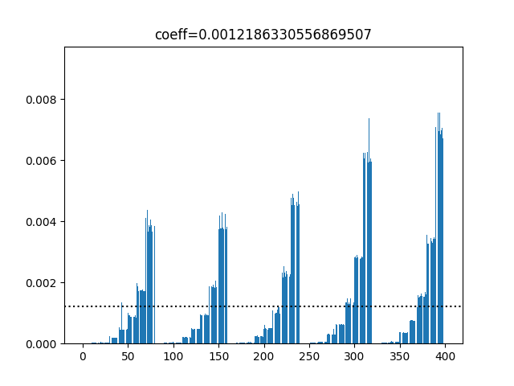
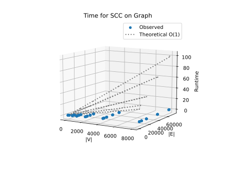
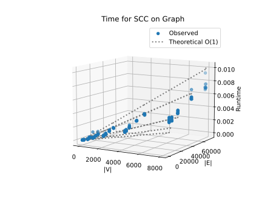
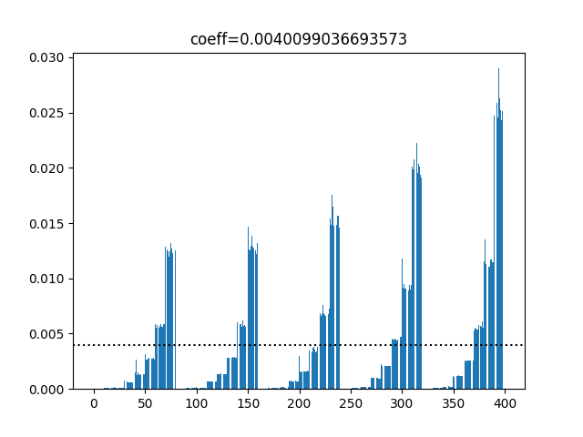
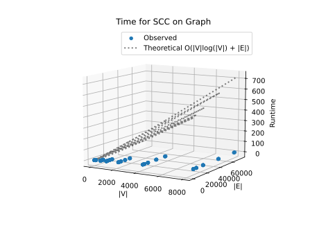
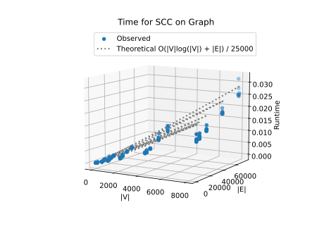

# Project Report - Network Analysis SCCs

## Baseline

### Design Experience

I talked with my brother Luke about the design of the prepost function

Discussion Points

    - Iterate through nodes in graph that haven't been visited, calling explore on each one
    - Recursively explore edge nodes that haven't been visited
    - Mark node as visited, and increment pre and post order of each node accordingly
    - Return dictionaries containing the pre and post order of each node.

### Theoretical Analysis - Pre/Post Order Traversal

#### Time 
```py
def prepost(graph: GRAPH) -> list[dict[str, list[int]]]:
    visited = set()
    order = [0]
    prepost = []
    for node in graph:                                          # Time: O(|V|) we make sure we visit all nodes
        if node not in visited:
            tree = {}
            explore(node, graph, visited, order, tree)                              
            prepost.append(tree)
    return prepost

def explore(node, graph: GRAPH, visited, order, tree):
    visited.add(node)
    order[0] += 1
    preorder = order[0]
    for edge in graph[node]:                                    # O(|V| + |E|) we explore all edges of graph, visiting nodes which haven't been visited yet
        if edge not in visited:
            explore(edge, graph, visited, order, tree)
    order[0] += 1
    postorder = order[0]
    tree[node] = [preorder, postorder]
```

The Time complexity of Prepost is O(|V|+|E|). Even though explore, which has O(|E|), is called inside a 
for-loop which iterates through all nodes, the explore function also visits nodes, marking them visited, so
they aren't visited by the outer for-loop. The loop is only there to catch nodes that are completely
isolated from others.

#### Space

```py
def prepost(graph: GRAPH) -> list[dict[str, list[int]]]:
    visited = set()
    order = [0]
    prepost = []
    for node in graph:                                         
        if node not in visited:
            tree = {}
            explore(node, graph, visited, order, tree)                              
            prepost.append(tree)                                # O(|V|) We are only saving the pre and post order of each node
    return prepost

def explore(node, graph: GRAPH, visited, order, tree):
    visited.add(node)
    order[0] += 1
    preorder = order[0]
    for edge in graph[node]:                                   
        if edge not in visited:
            explore(edge, graph, visited, order, tree)
    order[0] += 1
    postorder = order[0]
    tree[node] = [preorder, postorder]                   
```

The Space complexity is O(|V|) since we are only saving the pre and post order of nodes. Even though we iterate 
through edges, we only do so to visit nodes and get their pre and post order. As we visit edges, their order is saved
and the number of nodes we must iterate through in the for-loop decreased.

### Empirical Data

| Density Factor | Size  |    V    |    E    | Time (sec) |
| -------------- | ----- | ------- | ------- | ---------- |
| 0.25           | 10    | 10.0    | 12.8    | 0.0        |
| 0.25           | 50    | 50.0    | 61.6    | 0.0        |
| 0.25           | 100   | 100.0   | 123.5   | 0.0        |
| 0.25           | 500   | 500.0   | 616.1   | 0.0        |
| 0.25           | 1000  | 1000.0  | 1242.3  | 0.001      |
| 0.25           | 2000  | 2000.0  | 2496.5  | 0.001      |
| 0.25           | 4000  | 4000.0  | 4982.6  | 0.002      |
| 0.25           | 8000  | 8000.0  | 9967.0  | 0.005      |
| 0.5            | 10    | 10.0    | 17.7    | 0.0        |
| 0.5            | 50    | 50.0    | 85.2    | 0.0        |
| 0.5            | 100   | 100.0   | 173.1   | 0.0        |
| 0.5            | 500   | 500.0   | 872.2   | 0.0        |
| 0.5            | 1000  | 1000.0  | 1770.4  | 0.001      |
| 0.5            | 2000  | 2000.0  | 3551.4  | 0.001      |
| 0.5            | 4000  | 4000.0  | 7147.2  | 0.002      |
| 0.5            | 8000  | 8000.0  | 14361.9 | 0.005      |
| 1              | 10    | 10.0    | 24.5    | 0.0        |
| 1              | 50    | 50.0    | 134.1   | 0.0        |
| 1              | 100   | 100.0   | 272.5   | 0.0        |
| 1              | 500   | 500.0   | 1429.5  | 0.0        |
| 1              | 1000  | 1000.0  | 2921.5  | 0.001      |
| 1              | 2000  | 2000.0  | 5928.1  | 0.001      |
| 1              | 4000  | 4000.0  | 12010.6 | 0.003      |
| 1              | 8000  | 8000.0  | 24327.1 | 0.005      |
| 2              | 10    | 10.0    | 36.1    | 0.0        |
| 2              | 50    | 50.0    | 239.4   | 0.0        |
| 2              | 100   | 100.0   | 499.2   | 0.0        |
| 2              | 500   | 500.0   | 2710.2  | 0.0        |
| 2              | 1000  | 1000.0  | 5589.5  | 0.001      |
| 2              | 2000  | 2000.0  | 11450.9 | 0.001      |
| 2              | 4000  | 4000.0  | 23462.8 | 0.003      |
| 2              | 8000  | 8000.0  | 47740.4 | 0.007      |
| 3              | 10    | 10.0    | 46.0    | 0.0        |
| 3              | 50    | 50.0    | 356.9   | 0.0        |
| 3              | 100   | 100.0   | 766.3   | 0.0        |
| 3              | 500   | 500.0   | 4321.3  | 0.0        |
| 3              | 1000  | 1000.0  | 8788.2  | 0.001      |
| 3              | 2000  | 2000.0  | 17810.6 | 0.002      |
| 3              | 4000  | 4000.0  | 36212.5 | 0.004      |
| 3              | 8000  | 8000.0  | 73442.4 | 0.008      |


### Comparison of Theoretical and Empirical Results

- Theoretical order of growth: O(|V|+|E|) 
- Empirical order of growth (if different from theoretical): O(|V| + |E|) / 10000





Adjusted Plot: O(|V| + |E|) / 10000



The empirical order of growth was about 10 thousand times slower than our theoretical estimate. We assume the reason
is simply because of how fast modern computers are, and how efficient the python interpreter is.

## Core

### Design Experience

I talked about the design with my brother Luke

Discussion points

    - Create a function that reverses all the edges in the graph
    - run the reversed graph through the prepost function to get its postorder
    - Get the ssc's by doig a depth first search on the original graph using the reverse postorder

### Theoretical Analysis - SCC

#### Time 
```py
def find_sccs(graph: GRAPH) -> list[set[str]]:
    reverseGraph = reverse_graph(graph)             # O(|V| + |E|)
    reverseOrder = prepost(reverseGraph)            # O(|V| + |E|) From above in baseline section
    postOrder = {}
    for dictionary in reverseOrder:                 # O(|V|) Iterate through all nodes, saving the postorder value
        for key, value in dictionary.items():
            postOrder[key] = value[1]
    dictionaryValues = postOrder.items()
    sortedDictionary = sorted(dictionaryValues, key=lambda x: x[1], reverse=True)       # O(|V| * log(|V|)) The time complexity for the sort algorithm
    sortedNodes = []

    for key, value in sortedDictionary:             
        sortedNodes.append(key)

    SCCs = []
    visited = set()
    for node in sortedNodes:                        # O(|V|)
        if node not in visited:
            scc = set()
            exploreSCCs(node, graph, visited, scc)  # O(|V| + |E|)
            SCCs.append(scc)
    return SCCs


def reverse_graph(graph: GRAPH) -> GRAPH:
    reversed_graph = {}
    for node in graph:                            # O(|V| + |E|) Iterate through all nodes and edges, reversing the edges
        for edge in graph[node]:
            if(edge not in reversed_graph):
                reversed_graph[edge] = []
            reversed_graph[edge].append(node)
    for node in graph:
        if node not in reversed_graph:
            reversed_graph[node] = []
    return reversed_graph
```
The Time complexity of find_sccs is O(|V|log(|V|) + |E|). We must iterate through all of the nodes and edges each time we traverse the graph. However,
we also sort the nodes by their postorder which takes O(|V|log(|V|)) time. |V|log(|V|) dominates |V|, so we are left with
O(|V|log(|V|) + |E|).

#### Space

```py
def find_sccs(graph: GRAPH) -> list[set[str]]:
    reverseGraph = reverse_graph(graph)             # O(|V| + |E|)
    reverseOrder = prepost(reverseGraph)            # O(|V|) From above in baseline
    postOrder = {}
    for dictionary in reverseOrder:                 
        for key, value in dictionary.items():       # O(|V|) Iterate through all nodes
            postOrder[key] = value[1]
    dictionaryValues = postOrder.items()            # O(|V|) Save all nodes with postorder value
    sortedDictionary = sorted(dictionaryValues, key=lambda x: x[1], reverse=True)       # O(n) Sort all nodes
    sortedNodes = []

    for key, value in sortedDictionary:             # O(|V|) iterate through all nodes
        sortedNodes.append(key)

    SCCs = []
    visited = set()
    for node in sortedNodes:                        # O(|V|) iterate through nodes, created sets of sccs
        if node not in visited:
            scc = set()
            exploreSCCs(node, graph, visited, scc)  
            SCCs.append(scc)
    return SCCs


def reverse_graph(graph: GRAPH) -> GRAPH:
    reversed_graph = {}
    for node in graph:                              # O(|V| + |E|) to make a new, reverse graph, we have to store all nodes and edges
        for edge in graph[node]:
            if(edge not in reversed_graph):
                reversed_graph[edge] = []
            reversed_graph[edge].append(node)
    for node in graph:
        if node not in reversed_graph:
            reversed_graph[node] = []
    return reversed_graph
```

The Space complexity is O(|V| + |E|). In order to reverse the graph, we have to store both all the nodes and edges. Everything else
only requires storing nodes. So O(|V| + |E|) dominates.
### Empirical Data


| Density Factor | Size  |    V    |    E    | Time (sec) |
| -------------- | ----- | ------- | ------- | ---------- |
| 0.25           | 10    | 10.0    | 12.8    | 0.0        |
| 0.25           | 50    | 50.0    | 61.6    | 0.0        |
| 0.25           | 100   | 100.0   | 123.5   | 0.0        |
| 0.25           | 500   | 500.0   | 616.1   | 0.001      |
| 0.25           | 1000  | 1000.0  | 1242.3  | 0.001      |
| 0.25           | 2000  | 2000.0  | 2496.5  | 0.003      |
| 0.25           | 4000  | 4000.0  | 4982.6  | 0.006      |
| 0.25           | 8000  | 8000.0  | 9967.0  | 0.013      |
| 0.5            | 10    | 10.0    | 17.7    | 0.0        |
| 0.5            | 50    | 50.0    | 85.2    | 0.0        |
| 0.5            | 100   | 100.0   | 173.1   | 0.0        |
| 0.5            | 500   | 500.0   | 872.2   | 0.001      |
| 0.5            | 1000  | 1000.0  | 1770.4  | 0.001      |
| 0.5            | 2000  | 2000.0  | 3551.4  | 0.003      |
| 0.5            | 4000  | 4000.0  | 7147.2  | 0.006      |
| 0.5            | 8000  | 8000.0  | 14361.9 | 0.013      |
| 1              | 10    | 10.0    | 24.5    | 0.0        |
| 1              | 50    | 50.0    | 134.1   | 0.0        |
| 1              | 100   | 100.0   | 272.5   | 0.0        |
| 1              | 500   | 500.0   | 1429.5  | 0.001      |
| 1              | 1000  | 1000.0  | 2921.5  | 0.002      |
| 1              | 2000  | 2000.0  | 5928.1  | 0.004      |
| 1              | 4000  | 4000.0  | 12010.6 | 0.007      |
| 1              | 8000  | 8000.0  | 24327.1 | 0.015      |
| 2              | 10    | 10.0    | 36.1    | 0.0        |
| 2              | 50    | 50.0    | 239.4   | 0.0        |
| 2              | 100   | 100.0   | 499.2   | 0.0        |
| 2              | 500   | 500.0   | 2710.2  | 0.001      |
| 2              | 1000  | 1000.0  | 5589.5  | 0.002      |
| 2              | 2000  | 2000.0  | 11450.9 | 0.005      |
| 2              | 4000  | 4000.0  | 23462.8 | 0.009      |
| 2              | 8000  | 8000.0  | 47740.4 | 0.02       |
| 3              | 10    | 10.0    | 46.0    | 0.0        |
| 3              | 50    | 50.0    | 356.9   | 0.0        |
| 3              | 100   | 100.0   | 766.3   | 0.0        |
| 3              | 500   | 500.0   | 4321.3  | 0.001      |
| 3              | 1000  | 1000.0  | 8788.2  | 0.003      |
| 3              | 2000  | 2000.0  | 17810.6 | 0.006      |
| 3              | 4000  | 4000.0  | 36212.5 | 0.012      |
| 3              | 8000  | 8000.0  | 73442.4 | 0.026      |


### Comparison of Theoretical and Empirical Results

- Theoretical order of growth: O(|V|log(|V|) + |E|)
- Empirical order of growth (if different from theoretical): O(|V|log(|V|) + |E|) / 25000





Adjusted Plot: O(|V|log(|V|) + |E|) / 25000



The empirical order of growth was about 25 thousand times slower than our theoretical estimate. We, again, assume the reason
is simply because of how fast modern computers are, and how efficient the python interpreter is. It's hard to account for this drastic of a difference by simply evaluating the code.

## Stretch 1

### Design Experience

*Fill me in*

### Articulation Points Discussion 

*Fill me in*

## Stretch 2

### Design Experience

*Fill me in*

### Dataset Description

*Fill me in*

### Findings Discussion

*Fill me in*

## Project Review

I worked on this project with my little brother Luke. Luke's and my code ended up looking pretty 
similar, but we split it up in different ways. The biggest difference we saw was that I liked to 
use a set to store "visited" nodes, and check if nodes were in the set. Luke created a dictionary 
for each node, and used it to store a boolean called "visited". Our runtimes were nearly identical.