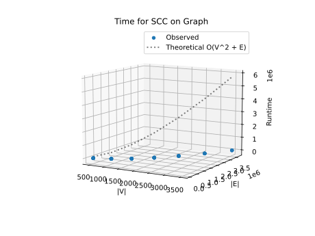
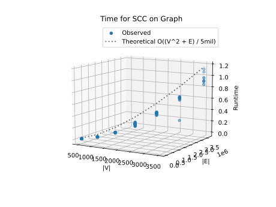
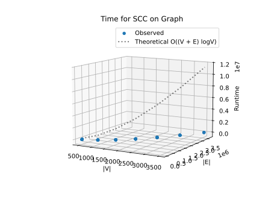
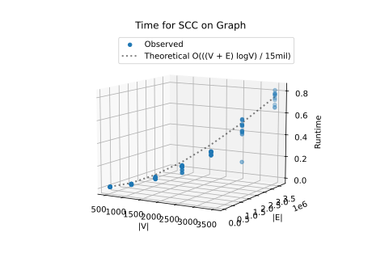

# Project Report - Network Routing

## Baseline

### Design Experience

I did my design experience with my little brother Luke

Discussion points
- Linear PQ
  - Make the PQ by appending nodes to the dictionary with distance set to infinity
  - Implement deleteMin by iterating through the dictionary and pop the highest priority node
  - Implement decrease key by finding node and changing the distance

- Dijkstra's
  - Set root node distance to 0 and all others to infinity
  - Initialize prioritiy queue, and search the graph, adding nodes and updating distances as you go
  - Store the shortest path to the node, and return it with the distance

### Theoretical Analysis - Dijkstra's With Linear PQ

#### Time 

```pycon
class LinearPQ:

    def __init__(self):
        self.queue = {}  # Dictionary for direct lookup

    def makeQueue(self, distances):
        """Initialize the queue with all nodes set to infinity, except the source."""

        # This section of code iterates through all the nodes and sets their distances to infinity
        # and has a time complexity of O(n).

        self.queue = distances.copy()

    def deleteMin(self):

        # This section of code extracts the minimum distance node from the linear priority queue.
        # In the linear implementation this operation has a time complexity of O(n).

        if not self.queue:
            return None, float("inf")
        node = min(self.queue, key=self.queue.get)
        return node, self.queue.pop(node)

    def decreaseKey(self, node, new_distance):

        # In the linear implementation, updating the key is O(1), but deleteMin is still O(n), so the overall impact remains O(n^2).

        if node in self.queue and new_distance < self.queue[node]:
            self.queue[node] = new_distance
------------------------------------------------------------------------------------------------------------------------------------------------------------\
def dijkstra(graph, source, target, use_heap=True):

    pq = HeapPQ() if use_heap else LinearPQ()
    distances = {node: float("inf") for node in graph} # adding nodes to 
    distances[source] = 0
    previous_nodes = {node: None for node in graph}

    pq.makeQueue(distances)

    while True:                # Iterates over all nodes O(V)
        current, current_dist = pq.deleteMin()      # also iterates over all nodes O(V)
        if current is None or current_dist == float("inf"):
            break  # No more reachable nodes

        if current == target:
            break  # Reached target

        for neighbor, weight in graph[current].items(): # This section of code examines all of the edges of all of the neighboring nodes
            new_dist = current_dist + weight  # and sees if the distance between two neighbors can be shortened by going through the current node.
            if new_dist < distances[neighbor]:  # Since this requires examining all of the edges, this has a time complexity of O(E).
                distances[neighbor] = new_dist
                previous_nodes[neighbor] = current
                pq.decreaseKey(neighbor, new_dist)

    if distances[target] == float("inf"):
        return [], float("inf")

    # Reconstruct path
    path, node = [], target
    while node is not None:     #O(V)
        path.append(node)
        node = previous_nodes[node]
    path.reverse()

    return path, distances[target]

```
The Time complexity is O(V^2 + E) deleteMin is O(V) and it is called on each node. However, "for neighbor....in graph" 
iterates over every edge, so we add +E

#### Space

```pycon
class LinearPQ:

    def __init__(self):
        self.queue = {}

    def makeQueue(self, distances):
        self.queue = distances.copy()       #O(V) stores all nodes

    def deleteMin(self):
        if not self.queue:  #O(1)
            return None, float("inf")
        node = min(self.queue, key=self.queue.get)  #O(1)
        return node, self.queue.pop(node)

    def decreaseKey(self, node, new_distance):
        if node in self.queue and new_distance < self.queue[node]:  #O(1)
            self.queue[node] = new_distance


def dijkstra(graph, source, target, use_heap=True):
    pq = HeapPQ() if use_heap else LinearPQ()
    distances = {node: float("inf") for node in graph}  #O(V) stores the distance of every node
    distances[source] = 0
    previous_nodes = {node: None for node in graph}     # O(V) store previous node for each node

    pq.makeQueue(distances)         #O(V) ^above

    while True:
        current, current_dist = pq.deleteMin()          #O(1)
        if current is None or current_dist == float("inf"):
            break

        if current == target:
            break

        for neighbor, weight in graph[current].items():
            new_dist = current_dist + weight    #O(1)
            if new_dist < distances[neighbor]:
                distances[neighbor] = new_dist  #O(1)
                previous_nodes[neighbor] = current  #O(1)
                pq.decreaseKey(neighbor, new_dist)  #O(1)

    if distances[target] == float("inf"):
        return [], float("inf")

    path, node = [], target
    while node is not None:     #O(V) path could have max length of V
        path.append(node)       
        node = previous_nodes[node]
    path.reverse()

    return path, distances[target]
```

The Space complexity is O(V) since we only store data on the nodes. We don't need to store any edge information. 

### Empirical Data - Dijkstra's With Linear PQ

Distribution: **uniform**  
Density: **0.3**  
Noise: **0.05**  
PQ Implementation: **Linear**  

|    V    |    E    | Time (sec) |
| ------- | ------- | ---------- |
| 500     | 75000.0 | 0.012      |
| 1000    | 300000.0 | 0.052      |
| 1500    | 675000.0 | 0.123      |
| 2000    | 1200000.0 | 0.256      |
| 2500    | 1875000.0 | 0.417      |
| 3000    | 2700000.0 | 0.609      |
| 3500    | 3675000.0 | 0.942      |

### Comparison of Theoretical and Empirical Results - Dijkstra's With Linear PQ

- Theoretical order of growth: O(V^2 + E)
- Empirical order of growth (if different from theoretical): same: O((V^2 + E) / 5mil)




Empirical results were a lot faster than theoretical, but when I divided my theoretical by 5 mil, it matched the empirical results nearly perfectly. I think it's probably just due to modern efficiencies in computing and the python interpreter.

## Core

### Design Experience

I did my design experience with Luke

Discussion points
- Dijkstra's logic is the same, but just implement method for switching between the linear and heap implementations
- heap priority queue using array
  - self.heap stores the nodes and their distances in a list of tuples
  - self.pointers stores the index of each node in the queue
  - Make queue calls insert on each node, adding it to the array
  - Insert appends the node to the queue and calls bubble
  - Bubble up compares node to parent and swaps if the node is higher priority
  - decrease key updates the distance of a node and calls bubble up
  - delete min swaps the root node and the last node, pops the root node off, and bubbles the last (now root) back down.

### Theoretical Analysis - Dijkstra's With Heap PQ

#### Time 

```pycon
class HeapPQ:
    def __init__(self):
        self.heap = []  # List of tuples (distance, node)
        self.pointers = {}  # Maps nodes to their heap indices

    def makeQueue(self, distances):
        # This section of code iterates through all the nodes and sets their distances to infinity
        # and has a time complexity of O(V).

        for node, dist in distances.items():
            self.insert(node, dist)

    def bubble_up(self, current):
        parent = (current - 1) // 2
        if current > 0 and self.heap[current][0] < self.heap[parent][0]:
            currentNode = self.heap[current][1]
            parentNode = self.heap[parent][1]
            self.heap[current], self.heap[parent] = self.heap[parent], self.heap[current]
            self.pointers[currentNode], self.pointers[parentNode] = parent, current
            self.bubble_up(parent)

    def bubble_down(self, current):
        child1 = current * 2 + 1
        child2 = current * 2 + 2
        favchild = child1
        if favchild >= len(self.heap):
            return
        if child2 < len(self.heap):
            if self.heap[child1][0] > self.heap[child2][0]:
                favchild = child2
        if self.heap[favchild][0] > self.heap[current][0]:
            return
        self.heap[favchild], self.heap[current] = self.heap[current], self.heap[favchild]
        currentNode = self.heap[favchild][1]
        childNode = self.heap[current][1]
        self.pointers[currentNode], self.pointers[childNode] = favchild, current
        self.bubble_down(favchild)

    def insert(self, node, distance):
        # This section of code inserts nodes into the binary heap priority queue.
        # This will take O(logV) time.

        self.heap.append((distance, node))
        current = len(self.heap) - 1
        self.pointers[node] = current
        self.bubble_up(current)

    def deleteMin(self):

        # This section of code extracts the minimum distance node from the binary heap priority queue.
        # In the binary heap implementation, deleteMin takes O(logV).
        if self.heap:
            dist, node = self.heap[0]
            if len(self.heap) == 1:
                self.heap.pop()
                del self.pointers[node]
                return node, dist

            self.heap[0] = self.heap.pop()
            self.pointers[self.heap[0][1]] = 0
            del self.pointers[node]
            self.bubble_down(0)
            return node, dist

    def decreaseKey(self, node, new_distance):

        # This section of code updates the distance of a node in the binary heap.
        # Since heapq does not support direct updates, we push the updated value and rely on heap properties.
        # This results in an O(logV) time complexity per call.
        index = self.pointers[node]
        if node in self.pointers and new_distance < self.heap[index][0]:
            self.heap[index] = (new_distance, node)
            self.bubble_up(index)
-----------------------------------------------------------------------------------------------------------------------------------------------------------------------
def dijkstra(graph, source, target, use_heap=True):
    pq = HeapPQ() if use_heap else LinearPQ()

    distances = {node: float("inf") for node in graph}
    distances[source] = 0
    previous_nodes = {node: None for node in graph}

    pq.makeQueue(distances)

    while True:
        current, current_dist = pq.deleteMin()
        if current is None or current_dist == float("inf"):
            break  # No more reachable nodes

        if current == target:
            break  # Reached target

        # This section of code examines all of the edges of all of the neighboring nodes
        # and sees if the distance between two neighbors can be shortened by going through the current node.
        # Since this requires examining all of the edges, this has a time complexity of O(E).

        for neighbor, weight in graph[current].items():
            new_dist = current_dist + weight
            if new_dist < distances[neighbor]:
                distances[neighbor] = new_dist
                previous_nodes[neighbor] = current
                pq.decreaseKey(neighbor, new_dist)

    if distances[target] == float("inf"):
        return [], float("inf")

    # Reconstruct path
    path, node = [], target
    while node is not None:
        path.append(node)
        node = previous_nodes[node]
    path.reverse()

    return path, distances[target]

```
Time complexity of heap implementation is O((V + E) logV), because deleteMin and decreaseKey both are O(logV) and they are called O(V + E) times.

#### Space

```pycon
class HeapPQ:
    def __init__(self):
        self.heap = []
        self.pointers = {}

    def makeQueue(self, distances):
        for node, dist in distances.items():
            self.insert(node, dist)         # O(V) store the node, node distance, and node index for every node

    def bubble_up(self, current):
        parent = (current - 1) // 2
        if current > 0 and self.heap[current][0] < self.heap[parent][0]:
            currentNode = self.heap[current][1]
            parentNode = self.heap[parent][1]
            self.heap[current], self.heap[parent] = self.heap[parent], self.heap[current]
            self.pointers[currentNode], self.pointers[parentNode] = parent, current
            self.bubble_up(parent)

    def bubble_down(self, current):
        child1 = current * 2 + 1
        child2 = current * 2 + 2
        favchild = child1
        if favchild >= len(self.heap):
            return
        if child2 < len(self.heap):
            if self.heap[child1][0] > self.heap[child2][0]:
                favchild = child2
        if self.heap[favchild][0] > self.heap[current][0]:
            return
        self.heap[favchild], self.heap[current] = self.heap[current], self.heap[favchild]
        currentNode = self.heap[favchild][1]
        childNode = self.heap[current][1]
        self.pointers[currentNode], self.pointers[childNode] = favchild, current
        self.bubble_down(favchild)
                                                                                                                        
    def insert(self, node, distance):
        self.heap.append((distance, node))
        current = len(self.heap) - 1
        self.pointers[node] = current
        self.bubble_up(current)

    def deleteMin(self):
        if self.heap:
            dist, node = self.heap[0]
            if len(self.heap) == 1:
                self.heap.pop()
                del self.pointers[node]
                return node, dist

            self.heap[0] = self.heap.pop()
            self.pointers[self.heap[0][1]] = 0
            del self.pointers[node]
            self.bubble_down(0)
            return node, dist

    def decreaseKey(self, node, new_distance):
        index = self.pointers[node]
        if node in self.pointers and new_distance < self.heap[index][0]:
            self.heap[index] = (new_distance, node)
            self.bubble_up(index)


def dijkstra(graph, source, target, use_heap=True):
    pq = HeapPQ() if use_heap else LinearPQ()

    distances = {node: float("inf") for node in graph}      # O(V) store distance for every node
    distances[source] = 0
    previous_nodes = {node: None for node in graph}     # O(V) store previous node for each node

    pq.makeQueue(distances)                             # O(V) above^ storing nodes, and their distance and index

    while True:
        current, current_dist = pq.deleteMin()
        if current is None or current_dist == float("inf"):
            break

        if current == target:
            break

        for neighbor, weight in graph[current].items():
            new_dist = current_dist + weight
            if new_dist < distances[neighbor]:
                distances[neighbor] = new_dist
                previous_nodes[neighbor] = current
                pq.decreaseKey(neighbor, new_dist)

    if distances[target] == float("inf"):
        return [], float("inf")

    path, node = [], target
    while node is not None:         #O(V) path could have max length of V
        path.append(node)
        node = previous_nodes[node]
    path.reverse()

    return path, distances[target]

```

The Space complexity of the heap implementation is still O(V) like the linear implementation. This is because not much changes space-wise between the two. Only the method of storage is changed. We do store the index as well with the heap, but this grows linearly with V.


### Empirical Data - Dijkstra's With Heap PQ

|    V    |    E    | Time (sec) |
| ------- | ------- | ---------- |
| 500     | 75000.0 | 0.01       |
| 1000    | 300000.0 | 0.04       |
| 1500    | 675000.0 | 0.092      |
| 2000    | 1200000.0 | 0.18       |
| 2500    | 1875000.0 | 0.292      |
| 3000    | 2700000.0 | 0.47       |
| 3500    | 3675000.0 | 0.735      |


### Comparison of Theoretical and Empirical Results - Dijkstra's With Heap PQ

- Theoretical order of growth: O((V + E) logV)
- Empirical order of growth (if different from theoretical): same: O(((V + E) logV) / 15mil)




Empirical results were again much lot faster than theoretical, and when I divided my theoretical by 15 mil, it matched the empirical results. Again, I think it's due to modern efficiencies in computing and the python interpreter.

### Relative Performance Of Linear versus Heap PQ Performance

The heap based PQ implementation ran consistently between 20-30% faster than the linear implementation. This is mainly because it can run deletemin in O(logn) time, instead of having to search the entire dictionary at O(n).

## Stretch 1

### Design Experience

*Fill me in*

### Empirical Data

| N    | Density | heap time (ms) | linear PQ time (ms) |
|------|---------|----------------|---------------------|
| 500  | .6      |                |                     |
| 1000 | .6      |                |                     |
| 1500 | .6      |                |                     |
| 2000 | .6      |                |                     |
| 2500 | .6      |                |                     |
| 3000 | .6      |                |                     |
| 3500 | .6      |                |                     |


| N    | Density | heap time (ms) | linear PQ time (ms) |
|------|---------|----------------|---------------------|
| 500  | 1       |                |                     |
| 1000 | 1       |                |                     |
| 1500 | 1       |                |                     |
| 2000 | 1       |                |                     |
| 2500 | 1       |                |                     |
| 3000 | 1       |                |                     |
| 3500 | 1       |                |                     |

### Plot

*Fill me in*

### Discussion

*Fill me in*

## Stretch 2

### Design Experience

*Fill me in*

### Provided Graph Generation Algorithm Explanation

*Fill me in*

### Selected Graph Generation Algorithm Explanation

*Fill me in*

#### Screenshots of Working Graph Generation Algorithm


## Project Review

I reviewed my project with Luke

Luke's and my linear PQ implementation is pretty much identical save a few minor things. My deleteMin function is a little simpler using a min function to extract the min, whereas Luke iterated through the dictionary. I think mine may have been a bit faster.

our dijkstras is also largely the same. For example, we iterate over the loop differently (I just use an infinite while loop, and Luke loops through the priority queue

My linear implementation was a little faster than Lukes overall, and we think it was because of our deleteMin functions.

For the Heap implementation we both use an array to store the nodes and distances, and a map to store the node indexes. I created an insert function which I call in my MakeQueue function, and Luke just inserted all the nodes directly in his MakeQueue.

In our bubble up and bubble down functions, Luke used a while loop to iterated through all the node swaps, whereas I recursively called those functions.

I realized that I checked for distance twice for deletemin in my Heap. I check in Dijkstras and in the deletemin function as well.

In my deletemin i deconstructed the root node immediately and stored it as a tuple. Then I popped the last value and replaced the root with the result of the pop call. Then I bubble down and returned the deconstructed root. Luke did it the more conventional way where he swapped the two values, and then popped the last value and stored it as min. Then he bubbled down and returned min.

My heap based implementation was a bit slower than Luke's on the last value, but faster for all the others. We think our implementations are generally the same as they kind of even out. We think the differences are too small to signify any meaningful runtime distance

