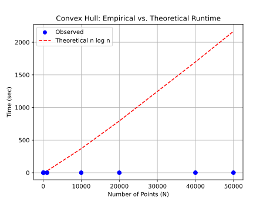
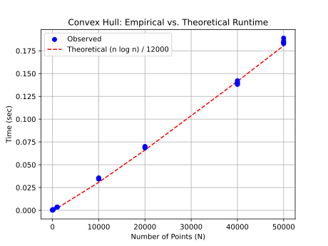

# Project Report - Convex Hull

## Baseline

### Design Discussion

I did my project with my brother Luke. 

#### Discussion Points
- We start by sorting the plot of points by their x values
- Then we start our divide and conquer algorithm by recursively dividing the plot into subplots
- The base case is a plot of 2 points, where we "compute the convex hull" by connecting the two points 
- As we recurse back up we merge the two hulls
  - find the common upper and lower tangents of the two hulls and draw a line between them
  - get rid of inside lines from the two hulls
- That should leave us with a finished convex hull.
### Theoretical Analysis - Convex Hull Divide-and-Conquer

#### Time 

```pycon
def compute_hull_dvcq(points: list[tuple[float, float]]) -> list[tuple[float, float]]:  #O(nlogn)

    sorted_points = sorted(points, key=lambda point: point[0]) # sorted() used Timsort which is O(nlogn)
    start_time = time.time()
    convex_hull = divide_and_conquer(sorted_points) # By the Master Theorem, T(n) = 2T(n/2) + O(n) → O(nlogn)
    end_time = time.time()

    print(f'Time Elapsed (Convex Hull): {end_time - start_time:.3f} sec')
    return convex_hull

def divide_and_conquer(points):     # divide and conquer recurses down logn times and considers every point on its way back up, so it's O(nlogn)
    if len(points) < 3: # base case
        return points

    mid = len(points) // 2           # Since the problem size is cut in half each time, we recurse down O(logn) times
    left_hull = divide_and_conquer(points[:mid])    # recursive calls
    right_hull = divide_and_conquer(points[mid:])

    return merge_hulls(left_hull, right_hull)   # worst case scenario of merge is that all points are along the hull and must be considered O(n)

def merge_hulls(left_hull, right_hull):     # Worst case: all points are along the convex hull (L + R) = O(n),  so merging is O(n)

    left_start = max(left_hull, key=lambda p: p[0])
    right_start = min(right_hull, key=lambda p: p[0])

    upper = find_upper_tangent(left_hull, right_hull, left_start, right_start)  # iterates through points along the hull of both the left and right hulls: O(L + R)
    lower = find_lower_tangent(left_hull, right_hull, left_start, right_start)  # iterates through points along the hull of both the left and right hulls: O(L + R)

    return construct_hull(left_hull, right_hull, upper, lower)

def find_upper_tangent(left_hull, right_hull, left_start, right_start): 

    i, j = left_hull.index(left_start), right_hull.index(right_start)
    left, right = True, True

    while left or right:    # iterates through points along the hull of both the left and right hulls: O(L + R)
        left, right = False, False
        while True:
            prev_i = (i - 1) % len(left_hull)
            new_slope = (right_hull[j][1] - left_hull[prev_i][1]) / (right_hull[j][0] - left_hull[prev_i][0])
            old_slope = (right_hull[j][1] - left_hull[i][1]) / (right_hull[j][0] - left_hull[i][0])
            if new_slope < old_slope:
                left = True
                i = prev_i
            else:
                break
        while True:
            next_j = (j + 1) % len(right_hull)
            new_slope = (right_hull[next_j][1] - left_hull[i][1]) / (right_hull[next_j][0] - left_hull[i][0])
            old_slope = (right_hull[j][1] - left_hull[i][1]) / (right_hull[j][0] - left_hull[i][0])
            if new_slope > old_slope:
                right = True
                j = next_j
            else:
                break
    return i, j

def find_lower_tangent(left_hull, right_hull, left_start, right_start):

    i, j = left_hull.index(left_start), right_hull.index(right_start)
    left, right = True, True

    while left or right:    # iterates through points along the hull of both the left and right hulls: O(L + R)
        left, right = False, False
        while True:
            next_i = (i + 1) % len(left_hull)
            new_slope = (right_hull[j][1] - left_hull[next_i][1]) / (right_hull[j][0] - left_hull[next_i][0])
            old_slope = (right_hull[j][1] - left_hull[i][1]) / (right_hull[j][0] - left_hull[i][0])
            if new_slope > old_slope:
                left = True
                i = next_i
            else:
                break
        while True:
            prev_j = (j - 1) % len(right_hull)
            new_slope = (right_hull[prev_j][1] - left_hull[i][1]) / (right_hull[prev_j][0] - left_hull[i][0])
            old_slope = (right_hull[j][1] - left_hull[i][1]) / (right_hull[j][0] - left_hull[i][0])
            if new_slope < old_slope:
                right = True
                j = prev_j
            else:
                break
    return i, j

def construct_hull(left_hull, right_hull, upper, lower):    # iterates through points along the hull of both the left and right hulls: O(L + R)
    
    final_hull = []
    
    i = lower[0]
    while i != upper[0]:    # Traverse left hull from lower to upper tangent → O(L)
        final_hull.append(left_hull[i])
        i = (i + 1) % len(left_hull)
    final_hull.append(left_hull[upper[0]])

    j = upper[1]
    while j != lower[1]:    # Traverse right hull from upper to lower tangent → O(R)
        final_hull.append(right_hull[j])
        j = (j + 1) % len(right_hull)
    final_hull.append(right_hull[lower[1]])

    return final_hull
```

The time complexity of compute_hull_dvcq is **O(nlogn)**. Sorting the points is O(nlogn), as is the divide and conquer algorithm. So in total we have O(2(nlogn)), or simply O(nlogn).

#### Space

```pycon
def compute_hull_dvcq(points: list[tuple[float, float]]) -> list[tuple[float, float]]:

    sorted_points = sorted(points, key=lambda point: point[0])  # Timsort has O(n) worst case space complexity
    start_time = time.time()
    convex_hull = divide_and_conquer(sorted_points) # worst case will be O(n) if all the points are along the convex hull
    end_time = time.time()  
    
    print(f'Time Elapsed (Convex Hull): {end_time - start_time:.3f} sec')
    return convex_hull

def divide_and_conquer(points): # divides plot into subplots O(n)
    if len(points) < 3:
        return points

    mid = len(points) // 2  # Recursion stack is O(logn), but I dont think that actually matters
    left_hull = divide_and_conquer(points[:mid])    # each recursive call creates two plots of n/2 size, so we always store O(n) points.
    right_hull = divide_and_conquer(points[mid:])   # each recursive call creates two plots of n/2 size, so we always store O(n) points.
    
    return merge_hulls(left_hull, right_hull)   # worst case will be O(n) if all the points are along the convex hull

def merge_hulls(left_hull, right_hull):

    left_start = max(left_hull, key=lambda p: p[0])     # O(1)
    right_start = min(right_hull, key=lambda p: p[0])   # O(1)

    upper = find_upper_tangent(left_hull, right_hull, left_start, right_start)  # O(1)
    lower = find_lower_tangent(left_hull, right_hull, left_start, right_start)  # O(1)
    return construct_hull(left_hull, right_hull, upper, lower)  # worst case will be O(n) if all the points are along the convex hull

def find_upper_tangent(left_hull, right_hull, left_start, right_start): 

    i, j = left_hull.index(left_start), right_hull.index(right_start)   #O(1)
    left, right = True, True    #O(1)

    while left or right:
        left, right = False, False  #O(1)
        while True:
            prev_i = (i - 1) % len(left_hull)   #O(1)
            new_slope = (right_hull[j][1] - left_hull[prev_i][1]) / (right_hull[j][0] - left_hull[prev_i][0])   #O(1)
            old_slope = (right_hull[j][1] - left_hull[i][1]) / (right_hull[j][0] - left_hull[i][0])     #O(1)
            if new_slope < old_slope:
                left = True 
                i = prev_i  #O(1)
            else:
                break
        while True:
            next_j = (j + 1) % len(right_hull)  #O(1)
            new_slope = (right_hull[next_j][1] - left_hull[i][1]) / (right_hull[next_j][0] - left_hull[i][0])   #O(1)
            old_slope = (right_hull[j][1] - left_hull[i][1]) / (right_hull[j][0] - left_hull[i][0])     #O(1)
            if new_slope > old_slope:
                right = True
                j = next_j  #O(1)
            else:
                break
    return i, j

def find_lower_tangent(left_hull, right_hull, left_start, right_start):

    i, j = left_hull.index(left_start), right_hull.index(right_start)   #O(1)
    left, right = True, True    #O(1)

    while left or right:
        left, right = False, False
        while True:
            next_i = (i + 1) % len(left_hull)   #O(1)
            new_slope = (right_hull[j][1] - left_hull[next_i][1]) / (right_hull[j][0] - left_hull[next_i][0])   #O(1)
            old_slope = (right_hull[j][1] - left_hull[i][1]) / (right_hull[j][0] - left_hull[i][0])     #O(1)
            if new_slope > old_slope:
                left = True
                i = next_i  #O(1)
            else:
                break
        while True:
            prev_j = (j - 1) % len(right_hull)  #O(1)
            new_slope = (right_hull[prev_j][1] - left_hull[i][1]) / (right_hull[prev_j][0] - left_hull[i][0])   #O(1)
            old_slope = (right_hull[j][1] - left_hull[i][1]) / (right_hull[j][0] - left_hull[i][0])     #O(1)
            if new_slope < old_slope:
                right = True
                j = prev_j  #O(1)
            else:
                break
    return i, j

def construct_hull(left_hull, right_hull, upper, lower):    # worst case will be O(n) if all the points are along the convex hull

    final_hull = []     # O(1)
    
    i = lower[0]
    while i != upper[0]:
        final_hull.append(left_hull[i])     # worst case will be O(n) if all the points are along the convex hull
        i = (i + 1) % len(left_hull)    # O(1)
    final_hull.append(left_hull[upper[0]])  # worst case will be O(n) if all the points are along the convex hull

    j = upper[1]
    while j != lower[1]:
        final_hull.append(right_hull[j])    # worst case will be O(n) if all the points are along the convex hull
        j = (j + 1) % len(right_hull)   # O(1)
    final_hull.append(right_hull[lower[1]]) # worst case will be O(n) if all the points are along the convex hull

    return final_hull
```

The space complexity is **O(n)**. Sorting the points takes O(n) space. Then in the divide and conquer algorithm, each recursive call creates two plots of n/2 size, so we ultimately store all points across the recursion stack, giving us O(n). Finally as we merge, we create a final hull. This hull has O(n) worst case space complexity in the case of all point being along the final convex hull. We are left with O(3n) or just O(n).

## Core

### Design Discussion

My core tests passed along with my baseline tests.

### Empirical Data - Convex Hull Divide-and-Conquer

| N     | Time (sec) |
|-------| ---------- |
| 10    | 0.0003     |
| 100   | 0.0006     |
| 1000  | 0.0035     |
| 10000 | 0.0347     |
| 20000 | 0.0692     |
| 40000 | 0.1397     |
| 50000 | 0.1845     |

### Comparison of Theoretical and Empirical Results

- Theoretical order of growth: O(nlogn)
- Empirical order of growth (if different from theoretical): O((nlogn) / 12000)




My theoretical runtime was much slower than the actual runtime, but by a constant factor of about 12 thousand. I assume this is just due to efficiencies in python interpreters.

## Stretch 1

### Design Discussion

*Fill me in*

### Chosen Convex Hull Implementation Description

*Fill me in*

### Empirical Data

| N     | time (ms) |
|-------|-----------|
| 10    |           |
| 100   |           |
| 1000  |           |
| 10000 |           |
| 20000 |           |
| 40000 |           |
| 50000 |           |

### Comparison of Chosen Algorithm with Divide-and-Conquer Convex Hull

#### Algorithmic Differences

*Fill me in*

#### Performance Differences

*Fill me in*

## Stretch 2

*Fill me in*

## Project Review

*Fill me in*

