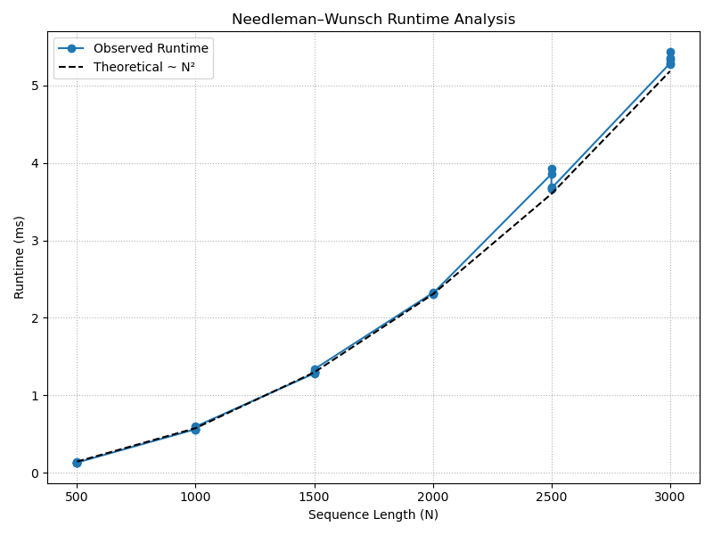

# Project Report - Alignment

## Baseline

### Design Experience

I talked about my design with my brother Luke

Discussion points

- Initialize 2 matrices with the two strings along the first row and column
- iterate through the first row and column and compute the insert penalty for each character of the 2 strings in the first matrix, and in the other matrix store their respective directions (up and left)
- Now iterate through all values of the first matrix, compare the characters of the two strings at that value, and compute the minimum value of the top, left, and diagonal values.
- For each computation, save the direction of that value in the matrix of directions
- After computing the minimum edit distance, start from the bottom right corner of the matrix of directions.
- Follow the directions back to the start to find the path

### Theoretical Analysis - Unrestricted Alignment

#### Time 

```pycon
def align(
        seq1: str,
        seq2: str,
        match_award=-3,
        indel_penalty=5,
        sub_penalty=1,
        banded_width=-1,
        gap_open_penalty=0,
        gap='-',
) -> tuple[float, str | None, str | None]:
    """
        Align seq1 against seq2 using Needleman-Wunsch
        Put seq1 on left (j) and seq2 on top (i)
        => matrix[i][j]
        :param seq1: the first sequence to align; should be on the "left" of the matrix
        :param seq2: the second sequence to align; should be on the "top" of the matrix
        :param match_award: how many points to award a match
        :param indel_penalty: how many points to award a gap in either sequence
        :param sub_penalty: how many points to award a substitution
        :param banded_width: banded_width * 2 + 1 is the width of the banded alignment; -1 indicates full alignment
        :param gap_open_penalty: how much it costs to open a gap. If 0, there is no gap_open penalty
        :param gap: the character to use to represent gaps in the alignment strings
    """
    len1 = len(seq1)
    len2 = len(seq2)
    #if banded_width == -1:  # baseline
    starting_array_val, starting_array_dir = compute_starting_arrays(seq1, seq2, len1, len2, gap, indel_penalty)    #O(n*m)
    finished_array_val, finished_array_dir = compute_path(starting_array_val, starting_array_dir, len1, len2,       #O(n*m)
        match_award, indel_penalty, sub_penalty)
    final_cost = finished_array_val[-1][-1]

    if final_cost == float('inf'):
        return final_cost, None, None

    string1, string2 = traceback(finished_array_dir, len1, len2, gap)                                               #O(maximum between n & m)
    string1_str = ''.join(string1) if string1 is not None else None
    string2_str = ''.join(string2) if string2 is not None else None

    return final_cost, string1_str, string2_str


def compute_starting_arrays(seq1, seq2, len1, len2, gap, indel_penalty):        
    matrix_val = [[''] * (len1 + 2) for _ in range(len2 + 2)]       #O(n*m)
    matrix_dir = [[''] * (len1 + 2) for _ in range(len2 + 2)]       #O(n*m)
    matrix_val[0][0], matrix_dir[0][0] = gap, gap                   #O(1)
    matrix_val[0][1], matrix_dir[0][1] = gap, gap                   #O(1)
    matrix_val[1][0], matrix_dir[1][0] = gap, gap                   #O(1)
    matrix_val[1][1], matrix_dir[1][1] = 0, 'NA'                    #O(1)
    insert_val_j = 0
    insert_val_i = 0
    for j in range(len1):                                               #O(n)
        insert_val_j += indel_penalty
        matrix_val[0][j + 2], matrix_dir[0][j + 2] = seq1[j], seq1[j]
        matrix_val[1][j + 2], matrix_dir[1][j + 2] = insert_val_j, 'L'
    for i in range(len2):                                               #O(m)
        insert_val_i += indel_penalty
        matrix_val[i + 2][0], matrix_dir[i + 2][0] = seq2[i], seq2[i]
        matrix_val[i + 2][1], matrix_dir[i + 2][1] = insert_val_i, 'U'
    return matrix_val, matrix_dir


def compute_path(matrix_val, matrix_dir, len1, len2, match_award, indel_penalty, sub_penalty):      #O(m*n)
    for i in range(len2):                   #O(m) 
        for j in range(len1):               #O(n)
            choices = []
            if matrix_val[0][j + 2] == matrix_val[i + 2][0]:
                Diagonal = matrix_val[i + 1][j + 1] + match_award
            else:
                Diagonal = matrix_val[i + 1][j + 1] + sub_penalty
            choices.append(Diagonal)
            Above = matrix_val[i + 1][j + 2] + indel_penalty
            choices.append(Above)
            Left = matrix_val[i + 2][j + 1] + indel_penalty
            choices.append(Left)
            min_score = min(choices)
            if min_score == Diagonal:
                matrix_val[i + 2][j + 2] = Diagonal
                matrix_dir[i + 2][j + 2] = 'D'
            elif min_score == Above:
                matrix_val[i + 2][j + 2] = Above
                matrix_dir[i + 2][j + 2] = 'U'
            elif min_score == Left:
                matrix_val[i + 2][j + 2] = Left
                matrix_dir[i + 2][j + 2] = 'L'
    return matrix_val, matrix_dir


def traceback(matrix_dir, len1, len2, gap):
    string1 = []
    string2 = []

    i, j = len2 + 1, len1 + 1       

    while i > 1 or j > 1:                       #O(maximum between n & m)
        if matrix_dir[i][j] == 'D':
            string1.append(matrix_dir[0][j])
            string2.append(matrix_dir[i][0])
            i -= 1
            j -= 1
        elif matrix_dir[i][j] == 'U':
            string1.append(gap)
            string2.append(matrix_dir[i][0])
            i -= 1
        elif matrix_dir[i][j] == 'L':
            string1.append(matrix_dir[0][j])
            string2.append(gap)
            j -= 1

    string1.reverse()
    string2.reverse()
    return string1, string2
```

The Time Complexity of align() is **O(n * m)**. I generated 2 arrays of n * m size and then iterated through each value to compute edit distances and directions. The traceback is determined by the maximum value between the two sequences O(n) or O(m). This is dominated by O(n * m).

#### Space

```pycon
def align(
        seq1: str,
        seq2: str,
        match_award=-3,
        indel_penalty=5,
        sub_penalty=1,
        banded_width=-1,
        gap_open_penalty=0,
        gap='-',
) -> tuple[float, str | None, str | None]:
    """
        Align seq1 against seq2 using Needleman-Wunsch
        Put seq1 on left (j) and seq2 on top (i)
        => matrix[i][j]
        :param seq1: the first sequence to align; should be on the "left" of the matrix
        :param seq2: the second sequence to align; should be on the "top" of the matrix
        :param match_award: how many points to award a match
        :param indel_penalty: how many points to award a gap in either sequence
        :param sub_penalty: how many points to award a substitution
        :param banded_width: banded_width * 2 + 1 is the width of the banded alignment; -1 indicates full alignment
        :param gap_open_penalty: how much it costs to open a gap. If 0, there is no gap_open penalty
        :param gap: the character to use to represent gaps in the alignment strings
    """
    len1 = len(seq1)
    len2 = len(seq2)
    #if banded_width == -1:  # baseline
    starting_array_val, starting_array_dir = compute_starting_arrays(seq1, seq2, len1, len2, gap, indel_penalty)    # O(n*m)
    finished_array_val, finished_array_dir = compute_path(starting_array_val, starting_array_dir, len1, len2,       # O(1)
        match_award, indel_penalty, sub_penalty)
    final_cost = finished_array_val[-1][-1]

    if final_cost == float('inf'):
        return final_cost, None, None

    string1, string2 = traceback(finished_array_dir, len1, len2, gap)
    string1_str = ''.join(string1) if string1 is not None else None
    string2_str = ''.join(string2) if string2 is not None else None

    return final_cost, string1_str, string2_str


def compute_starting_arrays(seq1, seq2, len1, len2, gap, indel_penalty):
    matrix_val = [[''] * (len1 + 2) for _ in range(len2 + 2)]                       # O(n*m)
    matrix_dir = [[''] * (len1 + 2) for _ in range(len2 + 2)]                       # O(n*m)
    matrix_val[0][0], matrix_dir[0][0] = gap, gap
    matrix_val[0][1], matrix_dir[0][1] = gap, gap
    matrix_val[1][0], matrix_dir[1][0] = gap, gap
    matrix_val[1][1], matrix_dir[1][1] = 0, 'NA'
    insert_val_j = 0
    insert_val_i = 0
    for j in range(len1):
        insert_val_j += indel_penalty
        matrix_val[0][j + 2], matrix_dir[0][j + 2] = seq1[j], seq1[j]
        matrix_val[1][j + 2], matrix_dir[1][j + 2] = insert_val_j, 'L'
    for i in range(len2):
        insert_val_i += indel_penalty
        matrix_val[i + 2][0], matrix_dir[i + 2][0] = seq2[i], seq2[i]
        matrix_val[i + 2][1], matrix_dir[i + 2][1] = insert_val_i, 'U'
    return matrix_val, matrix_dir


def compute_path(matrix_val, matrix_dir, len1, len2, match_award, indel_penalty, sub_penalty):      #O(1)
    for i in range(len2):                                           #O(1)
        for j in range(len1):
            choices = []                                            #O(1)
            if matrix_val[0][j + 2] == matrix_val[i + 2][0]:
                Diagonal = matrix_val[i + 1][j + 1] + match_award
            else:
                Diagonal = matrix_val[i + 1][j + 1] + sub_penalty
            choices.append(Diagonal)
            Above = matrix_val[i + 1][j + 2] + indel_penalty
            choices.append(Above)
            Left = matrix_val[i + 2][j + 1] + indel_penalty
            choices.append(Left)
            min_score = min(choices)
            if min_score == Diagonal:
                matrix_val[i + 2][j + 2] = Diagonal
                matrix_dir[i + 2][j + 2] = 'D'
            elif min_score == Above:
                matrix_val[i + 2][j + 2] = Above
                matrix_dir[i + 2][j + 2] = 'U'
            elif min_score == Left:
                matrix_val[i + 2][j + 2] = Left
                matrix_dir[i + 2][j + 2] = 'L'
    return matrix_val, matrix_dir


def traceback(matrix_dir, len1, len2, gap):                 #O(n + m)
    string1 = []                                            #O(n)
    string2 = []                                            #O(m)

    i, j = len2 + 1, len1 + 1

    while i > 1 or j > 1:
        if matrix_dir[i][j] == 'D':
            string1.append(matrix_dir[0][j])
            string2.append(matrix_dir[i][0])
            i -= 1
            j -= 1
        elif matrix_dir[i][j] == 'U':
            string1.append(gap)
            string2.append(matrix_dir[i][0])
            i -= 1
        elif matrix_dir[i][j] == 'L':
            string1.append(matrix_dir[0][j])
            string2.append(gap)
            j -= 1

    string1.reverse()
    string2.reverse()
    return string1, string2
```

The space complexity of align() is also **O(n * m)**. This because we have to store two arrays, both of size O(n * m). we can get rid of the constant factor of 2. After that, all computations are only updating values in these array, so no more space is required. The traceback function does require us to store the two strings with their final alignment, so that is O(n + m), but that is dominated by O(n * m).

### Empirical Data - Unrestricted Alignment

For empirical analysis, I'm just going to assume m and n have the same length (n), so O(n*m) is just O(n^2)

| N    | time (ms) |
|------|-----------|
| 500  | 132.1     |
| 1000 | 561.94    |
| 1500 | 1297.22   |
| 2000 | 2314.93   |
| 2500 | 3671.6    |
| 3000 | 5306.27   |


### Comparison of Theoretical and Empirical Results - Unrestricted Alignment

- Theoretical order of growth: O(n*m) -> O(n^2)
- Empirical order of growth (if different from theoretical): It matched pretty much perfectly



The theoretical order of growth matched my empirical nearly perfectly. There was a little hitch around 2500, but other than that it was basically identical.

## Core

### Design Experience

*Fill me in*


### Theoretical Analysis - Banded Alignment

#### Time 

*Fill me in*

#### Space

*Fill me in*

### Empirical Data - Banded Alignment

| N     | time (ms) |
|-------|-----------|
| 100   |           |
| 1000  |           |
| 5000  |           |
| 10000 |           |
| 15000 |           |
| 20000 |           |
| 25000 |           |
| 30000 |           |

### Comparison of Theoretical and Empirical Results - Banded Alignment

- Theoretical order of growth: 
- Empirical order of growth (if different from theoretical): 


*Fill me in*

### Relative Performance Of Unrestricted Alignment versus Banded Alignment

*Fill me in*


## Stretch 1

### Design Experience

*Fill me in*

### Code

```python
# Fill me in
```

### Alignment Scores

*Fill me in*

## Stretch 2

### Design Experience

*Fill me in*

### Alignment Outcome Comparisons

##### Sequences and Alignments

*Fill me in*

##### Chosen Parameters and Better Alignments Discussion

*Fill me in*

## Project Review

I compared my project with my brother Luke who is in this class

Luke and I did this project way differently. In our create matrix function, I created 2 matrices (one for scores and the other for directions). Luke created one matrix and had each element store a tuple with both a score and direction. I stored the sequences inside of my arrays as well, which allowed me to access sequence values from within the matrix. Luke passed the sequence values into all of his functions. In our compute path functions, Luke computed the values recursively, whereas I did it iteratively. Our traceback function are very similar, but we used different methods of bound checking. My runtimes were a bit faster than Luke's. Luke's runtimes were consistantly about 3 times slower than mine, we think it was due to his use of recursion. It was a cool comparison since we did them so differently.
