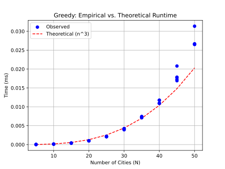
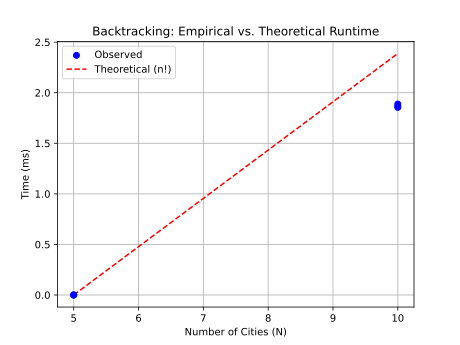

# Project Report - Backtracking

## Baseline

### Design Experience

I did my design experience with my brother Luke
- For baseline we are going to run a for loop to loop through all the cities; These will be the starting points.
- From each starting city, we will continuously pick the nearest city until we either find a solution, reach a dead end, or the timer runs out
- After finding our first solution, we will kill any paths that have a greater cost than that solution. If we find a cheaper solution, then we will append that solution to the list of solutions.
- After iterating through all the cities, we will return all of the solutions that we have found.

### Theoretical Analysis - Greedy

#### Time 

```pycon
def greedy_tour(edges: list[list[float]], timer: Timer) -> list[SolutionStats]:

    stats = []
    best_score = math.inf
    for start_city in range(len(edges)):    #O(n) iterate through all cities
        tour = [start_city]
        current_city = start_city

        while True:                         #O(n) iterate indefinitey until all neighbors are visited
            if timer.time_out():
                return stats
            closest_city = None
            closest_city_cost = math.inf
            for neighboring_city in range(len(edges[current_city])):       
                if neighboring_city in tour:
                    continue
                neighbor_cost = edges[current_city][neighboring_city]
                if neighbor_cost < closest_city_cost:
                    closest_city = neighboring_city
                    closest_city_cost = neighbor_cost

            if closest_city is None:
                break

            current_city = closest_city
            tour.append(closest_city)

            if len(tour) == len(edges):
                score = score_tour(tour, edges)         #O(n), but iterate through all cities in the tour to find total cost.
                if score < best_score:
                    best_score = score
                    stats.append(SolutionStats(
                        tour=tour,
                        score=best_score,
                        time=timer.time(),
                        max_queue_size=0,
                        n_nodes_expanded=0,
                        n_nodes_pruned=0,
                        n_leaves_covered=0,
                        fraction_leaves_covered=0
                    ))
                break

    if not stats:
        return [SolutionStats(
            [],
            math.inf,
            timer.time(),
            1,
            0,
            0,
            0,
            0
        )]
    else: return stats
```

greedy_tour() is O(n^3). It starts by iterating through every node as a starting point, which is O(n). For each node it explores all children until either a solution is found, or a dead-end is reached. This has worse case O(n). For each potential solution, we run score_tour, which must iterate through the entire tour, which is O(n), so we have O(n^3) overall.

#### Space

```pycon
def greedy_tour(edges: list[list[float]], timer: Timer) -> list[SolutionStats]:

    stats = []
    best_score = math.inf       #O(1)
    for start_city in range(len(edges)):
        tour = [start_city]     #O(1)
        current_city = start_city       #O(1)

        while True:
            if timer.time_out():
                return stats
            closest_city = None
            closest_city_cost = math.inf                #O(1)
            for neighboring_city in range(len(edges[current_city])):
                if neighboring_city in tour:
                    continue
                neighbor_cost = edges[current_city][neighboring_city]
                if neighbor_cost < closest_city_cost:
                    closest_city = neighboring_city
                    closest_city_cost = neighbor_cost

            if closest_city is None:
                break

            current_city = closest_city
            tour.append(closest_city)   #O(n) if the tour is a solution, it will be O(n) size, so this is O(n) worse case.

            if len(tour) == len(edges):
                score = score_tour(tour, edges)         #O(1)
                if score < best_score:
                    best_score = score
                    stats.append(SolutionStats(     #O(n) stats stores all tours, and worse case scenario, will store a tour for every starting city.
                        tour=tour,
                        score=best_score,
                        time=timer.time(),
                        max_queue_size=0,
                        n_nodes_expanded=0,
                        n_nodes_pruned=0,
                        n_leaves_covered=0,
                        fraction_leaves_covered=0
                    ))
                break

    if not stats:
        return [SolutionStats(
            [],
            math.inf,
            timer.time(),
            1,
            0,
            0,
            0,
            0
        )]
    else: return stats
```

The Space complexity is O(n^2). The stats list stores a list of tours, and has a worse case O(n) size. Each tour has O(n) size, so we have O(n^2) space complexity.

### Empirical Data - Greedy

| N   | reduction | time (ms) |
|-----| --------- | --------- |
| 5   | 0.0       | 0.03      |
| 10  | 0.0       | 0.13      |
| 15  | 0.0       | 0.4       |
| 20  | 0.0       | 0.98      |
| 25  | 0.0       | 2.22      |
| 30  | 0.0       | 3.91      |
| 35  | 0.0       | 6.74      |
| 40  | 0.0       | 10.99     |
| 45  | 0.0       | 16.92     |
| 50  | 0.0       | 26.62     |

### Comparison of Theoretical and Empirical Results - Greedy


- Theoretical order of growth: n^3
- Empirical order of growth (if different from theoretical): It matches the theoretical pretty closely.

## Core

### Design Experience

I did my design experience with Luke
- We will start by putting the starting city on the stack
- Then we'll start the loop that runs while the stack isn't empty and the timer hasnt run out
- In the loop we pop the path (the starting city on first iteration) and expand all children paths that haven't already been expanded
- If there is no solution, push that path back onto the stack
- If there is a solution AND it's the new cheapest solution, then add it to the list of solutions
- Return the list of solutions

### Theoretical Analysis - Backtracking

#### Time 

```pycon
def backtracking(edges: list[list[float]], timer: Timer) -> list[SolutionStats]:
    stack = [[0]]
    stats = []
    best_score = math.inf
    while stack and not timer.time_out():   
        tour = stack.pop()
        previous = tour[-1]

        if len(tour) == len(edges):
            score = score_tour(tour, edges)
            if score < best_score:
                best_score = score
                best_tour = tour
                stats.append(SolutionStats(
                    tour=best_tour,
                    score = best_score ,
                    time=timer.time(),
                    max_queue_size=1,
                    n_nodes_expanded=0,
                    n_nodes_pruned=0,
                    n_leaves_covered=0,
                    fraction_leaves_covered=0
                ))

        for neighboring_city in range(0, len(edges)):

            if neighboring_city in tour or edges[previous][neighboring_city] == math.inf:
                continue

            new_path = tour.copy()
            new_path.append(neighboring_city)
            stack.append(new_path)

    return stats
```

#### Space

```pycon
def backtracking(edges: list[list[float]], timer: Timer) -> list[SolutionStats]:
    stack = [[0]]
    stats = []
    best_score = math.inf
    while stack and not timer.time_out():
        tour = stack.pop()
        previous = tour[-1]

        if len(tour) == len(edges):
            score = score_tour(tour, edges)
            if score < best_score:
                best_score = score
                best_tour = tour
                stats.append(SolutionStats(
                    tour=best_tour,
                    score = best_score ,
                    time=timer.time(),
                    max_queue_size=1,
                    n_nodes_expanded=0,
                    n_nodes_pruned=0,
                    n_leaves_covered=0,
                    fraction_leaves_covered=0
                ))

        for neighboring_city in range(0, len(edges)):

            if neighboring_city in tour or edges[previous][neighboring_city] == math.inf:
                continue

            new_path = tour.copy()
            new_path.append(neighboring_city)
            stack.append(new_path)

    return stats
```

### Empirical Data - Backtracking

| N   | reduction | time (ms) |
|-----|-----------|-----------|
| 5   | 0         | 0.09      |
| 10  | 0         | 1898.0    |
| 15  | 0         | Timeout   |
| 20  | 0         |           |
| 25  | 0         |           |
| 30  | 0         |           |
| 35  | 0         |           |
| 40  | 0         |           |
| 45  | 0         |           |
| 50  | 0         |           |

### Comparison of Theoretical and Empirical Results - Backtracking



- Theoretical order of growth: n!
- Empirical order of growth (if different from theoretical): We think it was the same, hence we were only able to compute a couple points. 

### Greedy v Backtracking

*Fill me in*

### Water Bottle Scenario 

#### Scenario 1

**Algorithm:** 

*Fill me in*

#### Scenario 2

**Algorithm:** 

*Fill me in*

#### Scenario 2

**Algorithm:** 

*Fill me in*


## Stretch 1

### Design Experience

*Fill me in*

### Demonstrate BSSF Backtracking Works Better than No-BSSF Backtracking 

*Fill me in*

### BSSF Backtracking v Backtracking Complexity Differences

*Fill me in*

### Time v Solution Cost


*Fill me in*

## Stretch 2

### Design Experience

*Fill me in*

### Cut Tree

*Fill me in*

### Plots 

*Fill me in*

## Project Review

*Fill me in*
