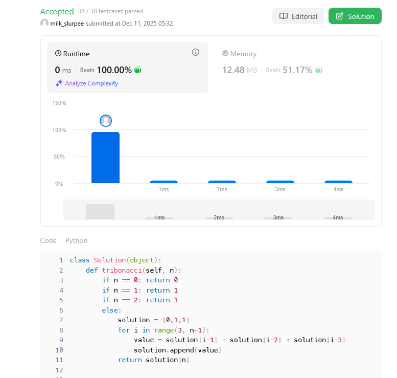
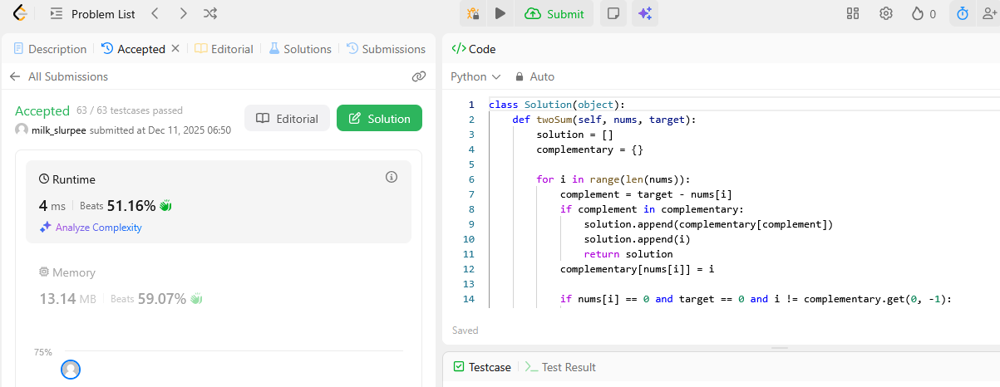

# Project Leetcode

## Baseline 

### Baseline Problem 1

#### Problem Information

Problem Name: Tribonacci

https://leetcode.com/problems/n-th-tribonacci-number/submissions/1852596234/



#### Time Complexity

```pycon
class Solution(object):
    def tribonacci(self, n):
        if n == 0: return 0
        if n == 1: return 1
        if n == 2: return 1
        else: 
            solution = [0,1,1]
            for i in range(3, n+1):
                value = solution[i-1] + solution[i-2] + solution[i-3]
                solution.append(value)
            return solution[n]
```

The Time complexity is **O(n)**. We have one loop that iterates up until n, updating the solution list on each iteration.

#### Space Complexity

```pycon
class Solution(object):
    def tribonacci(self, n):
        if n == 0: return 0
        if n == 1: return 1
        if n == 2: return 1
        else: 
            solution = [0,1,1]
            for i in range(3, n+1):
                value = solution[i-1] + solution[i-2] + solution[i-3]
                solution.append(value)
            return solution[n]
```

The Space complexity is also **O(n)**. The list is only appended to once on each iteration, so it will be n-length by the end.

----

### Baseline Problem 2

#### Problem Information

Problem Name: Two Sum

https://leetcode.com/problems/two-sum/submissions/1852659098/



#### Time Complexity

````pycon
class Solution(object):
    def twoSum(self, nums, target):
        solution = []
        complementary = {}
        
        for i in range(len(nums)):
            complement = target - nums[i]
            if complement in complementary:
                solution.append(complementary[complement])
                solution.append(i)
                return solution
            complementary[nums[i]] = i
            
            if nums[i] == 0 and target == 0 and i != complementary.get(0, -1):
                solution.append(complementary[0])
                solution.append(i)
                return solution
        
        return solution

````

The Time complexity is O(n) beacause I only iterate through the list once and stop when I find a complemntary number that leads to a solution.

#### Space Complexity

````pycon
class Solution(object):
    def twoSum(self, nums, target):
        solution = []
        complementary = {}
        
        for i in range(len(nums)):
            complement = target - nums[i]
            if complement in complementary:
                solution.append(complementary[complement])
                solution.append(i)
                return solution
            complementary[nums[i]] = i
            
            if nums[i] == 0 and target == 0 and i != complementary.get(0, -1):
                solution.append(complementary[0])
                solution.append(i)
                return solution
        
        return solution

````

The Space complexity is O(n) since we are just appending to the complementary dictionary once per iteration.

----

### Baseline Problem 3

#### Problem Information

Problem Name: *fill me in*

[Submission Link]()


#### Time Complexity

*Fill me in*

#### Space Complexity

*Fill me in*

----


## Core

### Core Problem 1

#### Problem Information

Problem Name: *fill me in*

[Submission Link]()


#### Time Complexity

*Fill me in*

#### Space Complexity

*Fill me in*

----

### Core Problem 2

#### Problem Information

Problem Name: *fill me in*

[Submission Link]()


#### Time Complexity

*Fill me in*

#### Space Complexity

*Fill me in*

----

### Core Problem 3

#### Problem Information

Problem Name: *fill me in*

[Submission Link]()


#### Time Complexity

*Fill me in*

#### Space Complexity

*Fill me in*

----

## Stretch 1

### Stretch 1 Problem 1

#### Problem Information

Problem Name: *fill me in*

[Submission Link]()


#### Time Complexity

*Fill me in*

#### Space Complexity

*Fill me in*

----

## Stretch 2

### Stretch 2 Problem 1

#### Problem Information

Problem Name: *fill me in*

[Submission Link]()


#### Time Complexity

*Fill me in*

#### Space Complexity

*Fill me in*

## Project Review

We both completed Tribonacci and Two Sum.

For Tribonacci we had very similar logic, basically identical to what was in the class slides. The only real difference was that I precomputed the first 3 values before entering the loop.
For Two Sum we did it a bit different, but basically the same logic. Luke stored numbers as he found them, and then looked for the complement. I stored complements for each number, and then looked for the complements for each number.